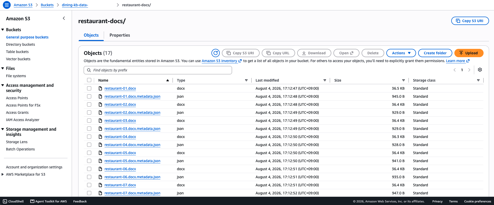
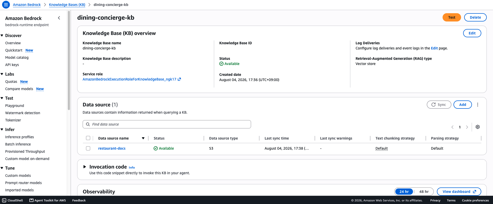
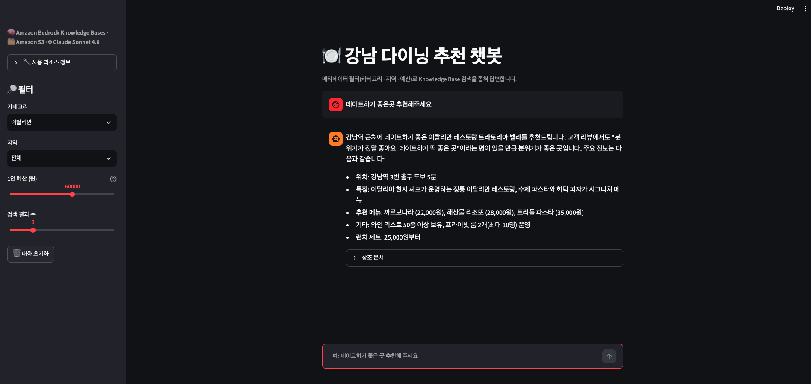

# 01-rag-basics

Amazon Bedrock Knowledge Bases로 RAG(Retrieval-Augmented Generation)를 처음부터
끝까지 구성하는 실습. S3에 문서를 올려 KB를 만들고, 검색 옵션(필터·하이브리드·
리랭킹)을 비교한 뒤, 메타데이터 필터가 붙은 대화형 챗봇으로 마무리한다.

## 실행 명령 구분

| 파일 | 실행 명령 |
|---|---|
| 숫자로 시작하는 파일(`01_upload_data.py`, `02_create_kb.py`, `03_test_search.py`, `01_filter_search.py` 등) | `python3 파일명.py` |
| `app.py` | `streamlit run app.py` |

`app.py`를 `python3 app.py`로 실행하면 `missing ScriptRunContext!` 경고만 뜨고
브라우저가 열리지 않는다. 반드시 `streamlit run`으로 실행한다.

## 최초 1회 준비

```bash
cd ~/aws-training/labs/mission/01-rag-basics
python3 -m venv .venv
source .venv/bin/activate
pip install boto3 streamlit
```

## 새 터미널마다 반복

```bash
cd ~/aws-training/labs/mission/01-rag-basics
source .venv/bin/activate
export KNOWLEDGE_BASE_ID="<콘솔에서 만든 KB의 ID>"
```

`.venv`를 활성화하지 않고 `streamlit run app.py`를 실행하면
`command not found: streamlit`이 뜬다. `source .venv/bin/activate`를
먼저 실행했는지 프롬프트에 `(.venv)` 표시가 붙었는지로 확인한다.

---

## 1. 01-build-kb/ — KB 구축

```bash
cd 01-build-kb
python3 01_upload_data.py      # S3 업로드
# (콘솔에서 KB 생성)
python3 02_create_kb.py        # 데이터 소스 동기화
python3 03_test_search.py      # CLI 검색 테스트
streamlit run app.py           # 브라우저 확인
```

S3 버킷 `restaurant-docs/` 안에 업로드된 문서와 메타데이터 JSON:



콘솔에서 생성한 KB 상세 페이지. 데이터 소스가 `Available` 상태로 동기화 완료:



---

## 2. 02-advanced-kb-search/ — 검색 옵션 비교

```bash
cd ../02-advanced-kb-search
python3 01_filter_search.py    # 필터 없음 vs 한식 필터
python3 02_hybrid_search.py    # SEMANTIC vs HYBRID
python3 03_rerank_search.py    # 리랭킹 전/후
python3 04_compare_search.py   # 4가지 종합 비교
```

**`04_compare_search.py` 실행 결과** — 질문: "회식하기 좋은 한식당 추천해 주세요"

| 설정 | 1순위 | 2순위 | 3순위 |
|------|-------|-------|-------|
| 기본 | 더 그린 키친 (건강한 식사) | 한우명가 (한식·역삼역) | 트라토리아 벨라 |
| 필터 (category=한식) | 한우명가 (한식·역삼역) | 서울갈비 강남본점 (한식, 40명까지 수용) | — |
| 하이브리드 | 트라토리아 벨라 (런치 세트 25,000원) | 더 그린 키친 | 한우명가 (한식·역삼역) |
| 리랭킹 | 더 그린 키친 | 한우명가 (한식·역삼역) | 트라토리아 벨라 |

필터를 걸면 한식이 아닌 결과가 완전히 제외되고, 리랭킹은 하이브리드 결과의
순서를 재조정하는 것을 확인할 수 있다.

**`03_rerank_search.py` 실행 결과** — 질문: "2명이서 데이트하기 좋은 곳 추천해 주세요. 예산은 1인 5만원이에요."
(HYBRID 검색 결과 5건에 Cohere Rerank 3.5를 적용, `score`는 각 방식의 relevance score)

| 순위 | 리랭킹 전 (HYBRID) | score | 리랭킹 후 | score |
|---|---|---|---|---|
| 1 | 트라토리아 벨라 메뉴/가격표 | 0.4230 | **트라토리아 벨라 리뷰**("데이트하기 딱 좋은 곳") | 0.4364 |
| 2 | 더 그린 키친 메뉴/가격표 | 0.4230 | 트라토리아 벨라 메뉴/가격표 | 0.4001 |
| 3 | 트라토리아 벨라 리뷰 | 0.4006 | 더 그린 키친 메뉴/가격표 | 0.3981 |
| 4 | 식당 요약표 | 0.3751 | 식당 요약표 | 0.2528 |
| 5 | 리뷰(서비스 관련) | 0.3648 | 리뷰(서비스 관련) | 0.1261 |

리랭킹 전에는 1·2위 score가 `0.4230`으로 완전히 동일해 사실상 동순위였다.
리랭킹 후에는 질문 의도("데이트하기 좋은 곳")에 가장 직접적으로 답하는
리뷰 청크가 1위로 올라오고, 상위·하위 score 격차도 0.42→0.44 대
0.36→0.13으로 훨씬 뚜렷해진다. 즉 리랭킹은 순서만 바꾸는 게 아니라
관련도가 낮은 결과를 점수 상으로도 확실히 밀어낸다.

---

## 3. 03-dining-chatbot/ — 최종 챗봇

```bash
cd ../03-dining-chatbot
streamlit run app.py
```

사이드바에서 메타데이터 필터(카테고리·지역·예산)를 걸면 `retrieve_and_generate`
호출 시 KB 검색 범위 자체가 좁혀진다.

**테스트 시나리오**: 카테고리 **이탈리안**, 예산 **6만원**, 검색 결과 수 **3**으로
설정 후 채팅창에 입력:

> 데이트하기 좋은곳 추천해주세요



이탈리안·6만원 이하 필터가 적용되어 조건에 맞는 **트라토리아 벨라** 한 곳을
근거로 답변이 생성됐다. 답변에 위치·특징·추천 메뉴·가격이 구조적으로 정리되어
나온다.

---

## 개선해볼 점

- **참조 문서 S3 URI가 계정 ID를 그대로 노출**: `03-dining-chatbot/app.py`가
  `retrieveAndGenerate` 응답의 `s3Location.uri`를 가공 없이 그대로
  `st.caption`으로 출력한다(`s3://dining-kb-data-<계정ID>/...`). 화면 캡처할
  때마다 가려야 하고, 사용자에게도 계정 ID가 그대로 노출된다. URI를
  파싱해서 파일명만 보여주도록 코드를 고치면 해결된다.

  ```python
  # 변경 전
  st.caption(uri)

  # 변경 후 — 버킷/계정 정보를 걷어내고 파일명만 노출
  filename = uri.rsplit("/", 1)[-1]
  st.caption(f"📄 {filename}")
  ```

- **데이터 소스가 늘어나면 동기화를 수동 `Sync` 클릭에 의존하게 됨**: 지금은
  `02_create_kb.py`로 최초 1회 동기화만 하고 끝나는데, 실무에서는 S3에 문서가
  추가·수정·삭제될 때마다 다시 동기화해야 한다. AWS는 이를 위한 서버리스
  아키텍처를 블로그로 공개했다: S3 이벤트를 **EventBridge**가 받아 **Lambda**가
  동기화 요청을 만들고, 계정당 5개/KB당 1개인 동시 실행 한도와
  `StartIngestionJob` 호출 제한(10초당 1회)을 **SQS**로 조절한 뒤 **Step
  Functions**가 `StartIngestionJob`을 호출하는 구조다([AWS ML Blog: Build and
  deploy an automatic sync solution for Amazon Bedrock Knowledge
  Bases](https://aws.amazon.com/blogs/machine-learning/build-and-deploy-an-automatic-sync-solution-for-amazon-bedrock-knowledge-bases/)).
  데이터 소스를 늘리는 다음 단계에서는 `02_create_kb.py`를 계속 수동으로 돌리는
  대신 이 패턴을 가져와 S3 업로드 → 자동 동기화로 바꿀 수 있다.
- **top_k=5인데 KB 문서가 실질적으로 몇 종류뿐**: 리랭킹 전/후 비교에서 4·5위
  청크는 순위가 그대로였다. 문서 풀이 작아서 리랭킹 효과가 상위 1~3위에만
  국한된다. 위 자동 동기화로 데이터 소스를 늘리면 리랭킹 효과도 더 뚜렷하게
  검증할 수 있다.
- **동일 score 동순위 처리 방식은 AWS가 공개 문서화하지 않음**: 리랭킹 전
  1·2위 score가 완전히 동일했다(`0.4230`). `Retrieve`/`Rerank` API 레퍼런스
  문서([RerankResult](https://docs.aws.amazon.com/bedrock/latest/APIReference/API_agent-runtime_RerankResult.html))에는
  `relevanceScore`와 원본 인덱스(`index`)만 정의돼 있고, 동점일 때의
  정렬 기준(원본 인덱스 순서인지, 내부 벡터 스토어의 반환 순서인지)은
  명시돼 있지 않다. 벡터 스토어 내부 구현에 의존하는 동작이라 재현성을
  보장하려면 애플리케이션 레벨에서 별도 정렬 기준(예: 2차 정렬 키)을
  두는 게 안전하다.
