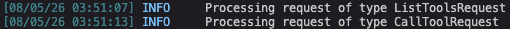
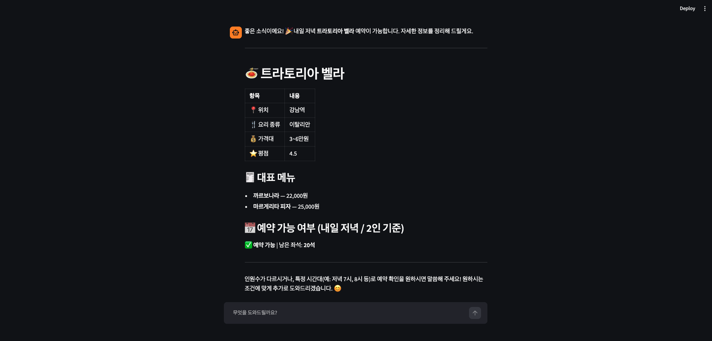
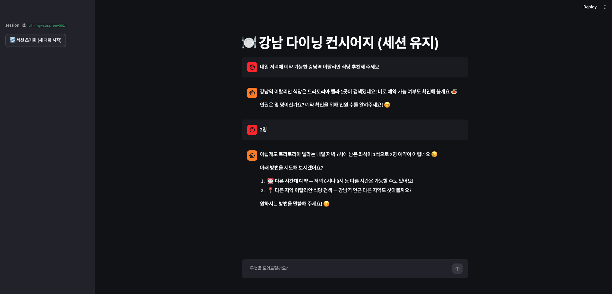
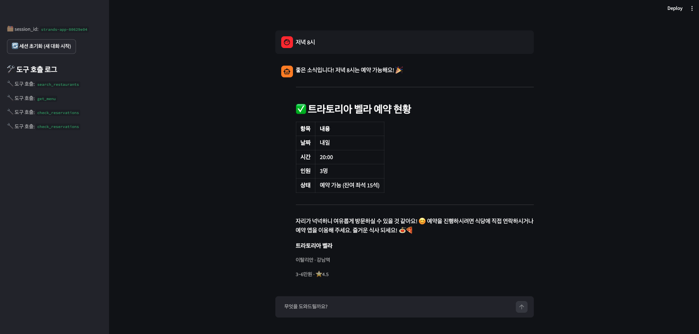

# 02-strands-agent

Strands Agents SDK로 `@tool` 커스텀 도구, MCP 서버 연동, 세션 영속화,
Streamlit 챗봇까지 단계적으로 쌓아가는 실습.

## 실행 명령 구분

| 파일 | 실행 명령 |
|---|---|
| `agent.py`, `test_conversation.py` | `python3 파일명.py` |
| `app.py` | `streamlit run app.py` |
| `mcp_server.py` | 직접 실행하지 않음 — `agent.py`/`app.py`가 서브프로세스로 자동 기동 |

`mcp_server.py`는 각 폴더의 `agent.py`/`app.py` 안에서
`MCPClient(lambda: stdio_client(StdioServerParameters(command=sys.executable, args=["mcp_server.py"])))`
로 stdio 서브프로세스로 띄워진다. 별도 터미널에서 `python3 mcp_server.py`를
먼저 실행해둘 필요 없음 — 그렇게 실행하면 stdio 표준입출력을 커맨드라인이
점유해 멈춘 것처럼 보인다(정상, `Ctrl+C`로 종료).

## 최초 1회 준비

```bash
cd ~/aws-training/labs/mission/02-strands-agent
python3 -m venv .venv
source .venv/bin/activate
pip install strands-agents mcp streamlit boto3
```

## 새 터미널마다 반복

```bash
cd ~/aws-training/labs/mission/02-strands-agent
source .venv/bin/activate
```

KNOWLEDGE_BASE_ID 같은 환경변수는 필요 없다 — 이 실습은 KB 대신 로컬
`@tool`(`tools.py`)과 MCP 서버(`mcp_server.py`)로 데이터를 제공한다.
Bedrock 모델(`us.anthropic.claude-sonnet-4-6`)만 `us-west-2` 리전에서
호출하므로, AWS 자격 증명이 로컬에 설정돼 있어야 한다.

---

## 1. 01-strands-tools/ — `@tool` + MCP 통합 에이전트

```bash
cd 01-strands-tools
python3 tools.py        # search_restaurants/get_menu 단독 호출 확인
python3 agent.py         # 통합 에이전트로 검색 → 예약 확인 테스트
streamlit run app.py      # 브라우저에서 최소 챗 UI 확인
```

- `tools.py`: 강남 식당 5곳 데이터 + `search_restaurants`, `get_menu` `@tool` 두 개.
- `mcp_server.py`: `check_reservations` 하나를 제공하는 FastMCP stdio 서버.
- `agent.py`: 두 로컬 도구 + MCP 도구를 모두 붙인 `Agent`로
  "내일 저녁 7시에 2명이 갈 만한 강남역 이탈리안 식당 찾고, 예약 가능한지
  확인해 주세요" 질의 실행.
- `app.py`: 위 에이전트 구성을 그대로 재사용한 최소 Streamlit 챗(입력창+응답만).

MCP 서버가 stdio로 실제 통신하는 로그(`ListToolsRequest` → `CallToolRequest`):



`agent.py` 실행 결과 — `search_restaurants`로 조건에 맞는 식당을 찾고,
같은 응답 안에서 `check_reservations`(MCP)까지 이어져 예약 가능 여부와
남은 좌석까지 함께 반환된다:



검색 도구와 예약 조회 도구가 순차 자동 선택되어, 이탈리안·강남역 조건에
맞는 식당(트라토리아 벨라)과 예약 가능 여부가 한 답변에 담기는 것을
확인했다.

---

## 2. 02-strands-session/ — 세션 영속화 + 재시작 복원

```bash
cd ../02-strands-session
python3 agent.py                     # 단독 실행 시 세션 파일 생성 확인
python3 test_conversation.py part1   # 5턴 대화
python3 test_conversation.py part2   # 프로세스 재시작 후 회상 테스트
streamlit run app.py                 # 세션 유지 + 초기화 버튼 확인
```

- `agent.py`: `FileSessionManager(session_id="dining-session-001", storage_dir="./sessions")` +
  `SlidingWindowConversationManager(window_size=10)`를 붙인 `build_agent()` 팩토리.
  실행하면 `./sessions/`에 세션 JSON 파일이 생성된다.
- `test_conversation.py`: `part1`으로 5턴(추천 → 예산 필터 → 제외 요청 →
  재질문 → 메뉴 질문) 대화 후 프로세스 종료, `part2`로 별도 프로세스에서
  같은 `session_id`로 재기동해 "지난번 추천받은 그 식당" 질문.
- `app.py`: 채팅 UI + 사이드바에 `session_id` 표시 + "세션 초기화" 버튼
  (누르면 새 `session_id`로 전환되어 이전 대화를 회상하지 못하는 것을 확인
  가능).

사이드바에 `session_id: dining-session-001`이 표시된 채로, "2명"이라는
후속 답변만으로도 앞 문맥(식당·날짜)을 이어받아 예약을 재확인하는 것을
볼 수 있다(트라토리아 벨라는 좌석 부족으로 예약 불가 → 대안 제시):



`part1`(5턴 대화) 종료 후 `./sessions/` 폴더에 `dining-session-001` 관련
JSON이 생성됐고, `part2`(재시작 후 실행)에서 이전에 추천받은 식당을 실제로
회상해 예약 확인까지 이어지는 것을 확인했다.

---

## 3. 03-strands-app/ — Streamlit 다이닝 컨시어지 챗봇 (최종)

```bash
cd ../03-strands-app
python3 agent.py       # create_agent() 단독 생성 테스트
streamlit run app.py    # 최종 챗봇 UI
```

- `agent.py`: `create_agent(session_id, callback_handler=None)` 팩토리 —
  `BedrockModel` + 로컬 도구 + MCP 도구 + 세션/대화 관리자를 한 번에 구성.
- `app.py`: 멀티턴 채팅 UI + 사이드바에 `session_id` 표시·초기화 버튼(02번과
  동일 패턴) + 도구 호출 로그(`callback_handler`로 수집) + 응답에 언급된
  식당을 카드(`st.columns`)로 표시.

사이드바에 `session_id: strands-app-80629e04`와 도구 호출 로그
(`search_restaurants` → `get_menu` → `check_reservations` → `check_reservations`)가
쌓이고, 예약 재확인 결과가 표와 식당 카드로 함께 렌더된다:



채팅·사이드바 도구 호출 로그·추천 카드가 모두 렌더됐고, "거기 말고 르
비스트로로 바꿔 주세요" 같은 후속 질문에도 인원·시간 맥락이 유지된 채
식당만 바뀌는 멀티턴 동작을 확인했다. `check_reservations`가 연속으로 두 번
호출된 것은 인원 수를 먼저 묻고, 사용자가 답하면 확정된 인원으로 다시
조회하기 때문이다.

---

## 개선해볼 점

- **이전 세션으로 돌아갈 수 없음**: `03-strands-app/app.py`의 "세션 초기화"
  버튼은 새 `session_id`를 발급해 새 대화를 시작할 뿐, 이미 만들어진
  이전 세션 목록을 보여주거나 그중 하나로 돌아가는 기능은 없다.
  `./sessions/` 아래 세션 폴더가 쌓이는 걸 활용해, 사이드바에 기존
  `session_id` 목록을 보여주고 선택하면 그 세션으로 전환하는 UI를 추가하면
  대화를 이어가거나 과거 대화를 다시 확인할 수 있다.
- **`check_reservations`가 인원 미확정 상태에서 먼저 호출됨**: 03번 캡처에서
  보이듯 사용자가 인원을 말하기 전에 한 번, 인원 확정 후 다시 한 번 —
  같은 도구가 두 번 연속 호출된다. `mcp_server.py`의 `check_reservations`가
  `party_size`를 필수 인자로 받다 보니, 모델이 불완전한 정보로도 도구를
  일단 호출하고 재질문하는 패턴을 보인다. 시스템 프롬프트에 "필수 정보가
  없으면 도구를 호출하지 말고 먼저 물어볼 것"을 명시하면 불필요한 호출을
  줄일 수 있다.
- **좌석 수가 실행마다 달라짐**: `check_reservations`의 남은 좌석은
  `hash((restaurant_name, date, time)) % 1000`을 시드로 쓰는데, `date`/`time`
  인자가 "내일"·"내일 저녁"처럼 매번 자연어로 다르게 들어올 수 있어 같은
  질문도 실행마다 다른 좌석 수가 나올 수 있다(01번 캡처는 20석, 03번은 3명
  기준 15석). 데모용 랜덤이라 문제는 아니지만, 재현 가능한 시연이 필요하면
  `date`/`time`을 표준 형식으로 정규화한 뒤 시드로 쓰는 게 안전하다.
- **예약 데이터가 프로세스 메모리에만 있어 동시 예약을 못 막음**: 지금
  `check_reservations`는 실행마다 `random.Random(seed)`로 좌석 수를 즉석에서
  만들 뿐, 실제로 좌석을 차지했다는 상태를 어디에도 기록하지 않는다.
  두 사용자가 같은 식당·시간에 동시에 예약을 확인하면 둘 다 "예약 가능"을
  받을 수 있다(동시 예약 충돌을 감지할 방법이 없음). 04번 미션에서 이
  도구가 "로컬 MCP 서버 의존이라 배포 범위에서 제외"된 이유도 같은 맥락이다
  — 로컬 프로세스 메모리는 여러 사용자·여러 배포 인스턴스가 상태를 공유할
  수 없다. 실제로 예약 상태를 저장하려면 **DynamoDB**에 좌석 수를 저장하고,
  예약 확정 시 `ConditionExpression`으로 조건부 쓰기(예:
  `remaining_seats >= :party_size`)를 걸면 동시에 들어온 두 예약 요청 중
  하나만 성공하게 만들 수 있다([AWS DB Blog: Handle conditional write errors
  in high concurrency scenarios with Amazon
  DynamoDB](https://aws.amazon.com/blogs/database/handle-conditional-write-errors-in-high-concurrency-scenarios-with-amazon-dynamodb/)).
  이건 04/05번에서 다루는 Runtime 배포·Memory·Gateway 확장과는 별개로,
  `mcp_server.py`가 다루는 예약 데이터 자체의 한계다.
