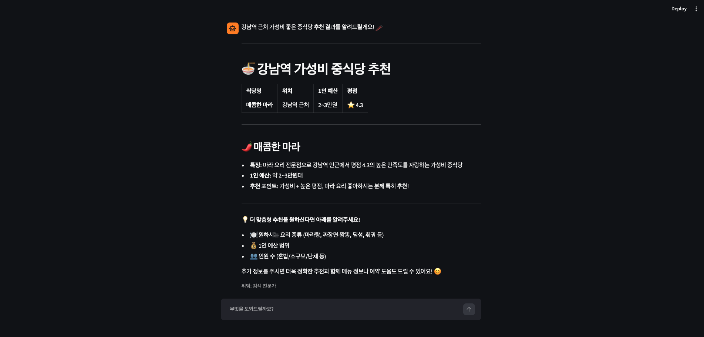
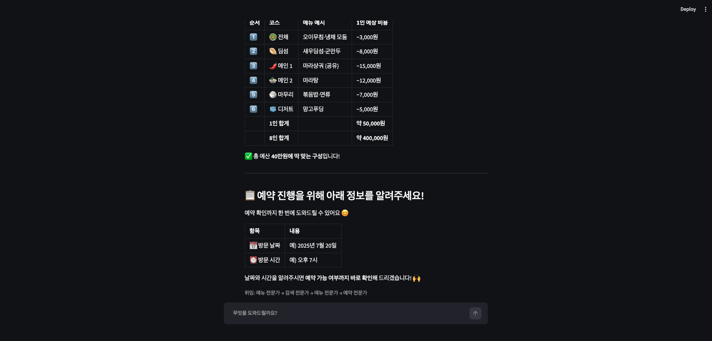
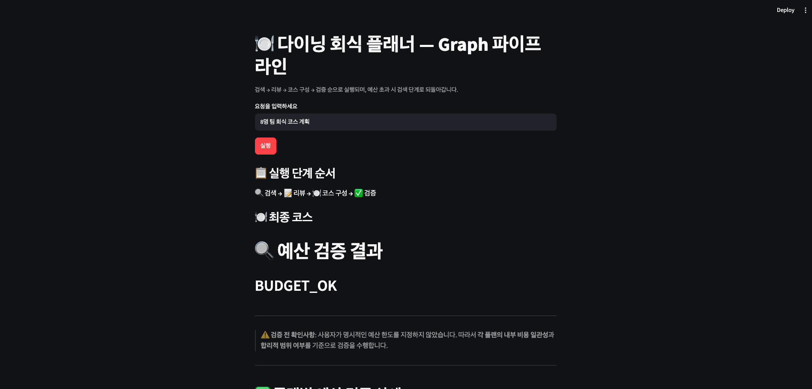
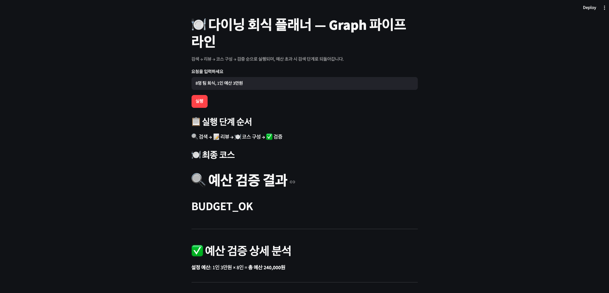
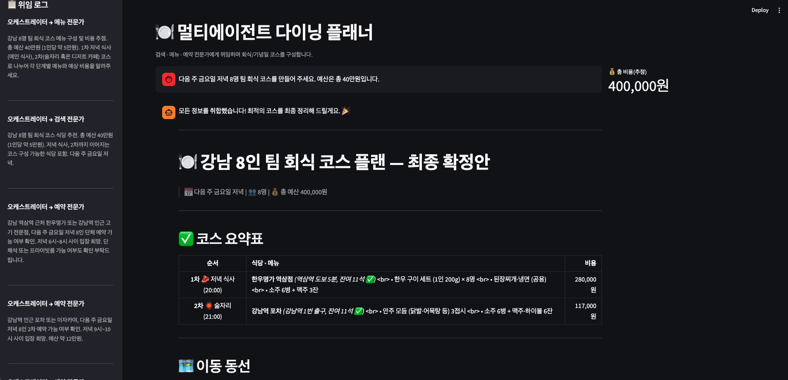
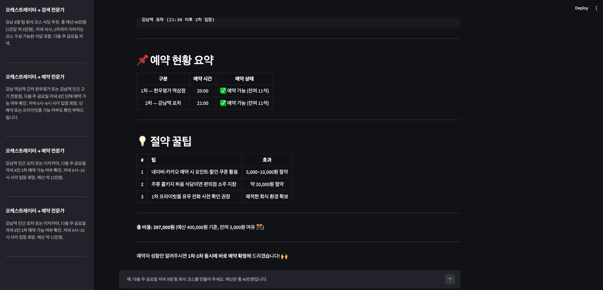

# 03-multiagent-collaboration

Strands Agents SDK의 멀티에이전트 협업 패턴 3가지(agents-as-tools 위임,
Graph 조건 분기, 콜백 기반 오케스트레이션)를 단계적으로 쌓아가는 실습.
도구(`tools.py`)는 02-strands-agent보다 늘어나 `estimate_cost`,
`create_reservation`까지 포함한다.

## 실행 명령 구분

| 파일 | 실행 명령 |
|---|---|
| `tools.py`, `agents.py`, `orchestrator.py`, `graph_pipeline.py`, `planner_engine.py` | `python3 파일명.py` |
| `app.py` | `streamlit run app.py` |

MCP stdio 서버가 없다 — 이 미션은 예약까지 로컬 `@tool`
(`check_reservations`, `create_reservation`)로만 처리한다(02-strands-agent의
`mcp_server.py`와 달리 별도 프로세스를 띄우지 않음).

## 최초 1회 준비

```bash
cd ~/aws-training/labs/mission/03-multiagent-collaboration
python3 -m venv .venv
source .venv/bin/activate
pip install strands-agents strands-agents-tools streamlit boto3 nest_asyncio
```

## 새 터미널마다 반복

```bash
cd ~/aws-training/labs/mission/03-multiagent-collaboration
source .venv/bin/activate
```

KNOWLEDGE_BASE_ID, 환경변수 설정 불필요. Bedrock 모델
(`us.anthropic.claude-sonnet-4-6`)만 `us-west-2` 리전에서 호출하므로 AWS
자격 증명이 로컬에 설정돼 있어야 한다.

---

## 1. 01-multiagent-delegation/ — agents-as-tools 위임

```bash
cd 01-multiagent-delegation
python3 tools.py         # 5개 도구 단독 호출 확인 (JSON 반환)
python3 agents.py        # 전문가 3개(검색/메뉴/예약) 개별 실행
python3 orchestrator.py  # 위임 로그 + 통합 응답 확인
streamlit run app.py      # 브라우저에서 위임 라벨 확인
```

- `tools.py`: 이번 미션부터 `estimate_cost`(인당 평균가×인원), `create_reservation`
  (예약 확정, 메모리 딕셔너리에 저장)까지 5개 도구.
- `agents.py`: 검색/메뉴·비용/예약 전문가 3개를 독립된 `system_prompt`로 생성.
- `orchestrator.py`: 전문가 3개를 `@tool`로 감싸(`ask_search_expert` 등) 오케스트레이터에
  등록. 위임마다 `print` 로그 + 전역 `delegation_log` 리스트에 전문가 이름 기록.
- `app.py`: 오케스트레이터를 그대로 가져와 채팅 UI + 응답 아래 위임 라벨(`위임: 검색 전문가 → ...`) 표시.

"강남역 근처 가성비 좋은 중식당 추천해 주세요"(단일 위임) — 검색 전문가
한 명에게만 위임되어 가성비 중식당(매콤한 마라)을 추천하고, 위임 라벨이
`위임: 검색 전문가`로만 표시된다:



"8명 팀 회식 코스를 짜 주세요. 예산은 총 40만원입니다."(복합 위임) —
검색→메뉴→예약 순으로 여러 전문가가 호출되어 코스표와 비용이 함께 반환되고,
위임 라벨에 `메뉴 전문가 → 검색 전문가 → 메뉴 전문가 → 예약 전문가`가
복합으로 찍힌다:



요청 성격(단순 추천 vs 복합 코스 구성)에 따라 오케스트레이터가 위임 대상을
자동 선택하고, 위임 라벨이 이를 반영하는 것을 확인했다.

---

## 2. 02-multiagent-graph-swarm/ — Graph 조건 분기 파이프라인 (Option A)

```bash
cd ../02-multiagent-graph-swarm
python3 graph_pipeline.py   # 검색→리뷰→코스→검증, 예산 초과 시 재검색
streamlit run app.py          # 실행 단계 순서 + 최종 코스 확인
```

Option B(Swarm 자율 협업)는 이 실습에서 선택하지 않았다 — `swarm_collab.py`
없음, Graph만 구현.

- `graph_pipeline.py`: `GraphBuilder`로 `search → review → course → validate`
  노드를 순서대로 연결. `validate` 노드가 응답에 `BUDGET_EXCEEDED`를 쓰면
  `search`로 되돌아가는 조건 엣지(`is_budget_exceeded`) 추가. 무한 루프
  방지로 `set_max_node_executions(8)` + `set_execution_timeout(120)`.
- `app.py`: 요청 입력 → 그래프 실행 → 실행 단계 순서(`🔍 검색 → 📝 리뷰 →
  🍽️ 코스 구성 → ✅ 검증`)와 최종 코스, 단계별 상세 결과(expander) 표시.

"8명 팀 회식 코스 계획"(예산 미지정) — 예산 조건 없이 실행하면 검색→리뷰→
코스 구성→검증이 1회로 종료되고 `BUDGET_OK`가 나온다:



"8명 팀 회식, 1인 예산 3만원" — 예산 조건이 있으면 검증 노드가 플랜별
예산 초과 여부를 분석한다. 이 실행에서는 플랜 A(매콤한 마라, 1인
18,500원)가 예산 내로 채택되고, 플랜 B(트라토리아 벨라, 1인 23,500원)는
추가 주문 시 초과 위험으로 비권장 판정됐다:



최종 확정 코스:

| 항목 | 플랜 A (매콤한 마라) | 플랜 B (트라토리아 벨라) |
|---|---|---|
| 1차 식사 비용 | 148,000원 | 188,000원 |
| 1인당 비용 | 18,500원 | 23,500원 |
| 1인 예산(30,000원) 대비 | +11,500원 여유 | +6,500원 여유 |
| 예산 초과 여부 | ✅ 초과 없음 | ⚠️ 추가 주문 시 초과 위험 |

검증 노드가 `BUDGET_OK`를 반환한 이후 그래프가 종료되어 추가 실행이
없는 것을 확인했다. 재검색 분기(예산을 크게 초과하는 결과만 나올 때)는
이 데이터셋에서는 발생하지 않았다 — 강남 식당 5곳이 모두 3만원 이하
메뉴를 포함하기 때문.

---

## 3. 03-multiagent-app/ — 콜백 기반 오케스트레이션 + 코스표 UI

```bash
cd ../03-multiagent-app
python3 planner_engine.py                          # 콜백으로 위임 이벤트 수집 확인
streamlit run app.py --server.port 8501             # 최종 앱
```

- `planner_engine.py`: `DiningPlannerEngine` 클래스 — 전문가 3개 + 오케스트레이터를
  캡슐화하고, 위임마다 `on_delegation(agent_name, query)` 콜백을 호출.
  `__main__`에서 콜백을 리스트에 쌓아 확인 가능.
- `app.py`: 사이드바에 위임 로그를 실시간 표시, 메인에 코스표(markdown
  표: 순서|식당·메뉴|비용)와 `st.metric`으로 총 비용 표시. 응답 텍스트에서
  "총 ...원"/"...만원" 패턴을 정규식으로 뽑아 `st.session_state.last_total_cost`에 저장.

"다음 주 금요일 저녁 8명 팀 회식 코스를 만들어 주세요. 예산은 총
40만원입니다." — 사이드바에 메뉴 전문가 → 검색 전문가 → 예약 전문가
순으로 위임 로그가 쌓이고, 메인에 코스 요약표와 `st.metric`으로 총 비용
400,000원이 표시된다:



응답 하단에 예약 현황 요약(1차·2차 모두 예약 가능, 잔여 11석)과
절약 꿀팁까지 표시된다. 예약 전문가가 두 번 호출된 것은 1차·2차 식당의
예약을 각각 확인했기 때문이다:



사이드바 위임 로그·코스표 테이블·총 비용 메트릭이 모두 정상 렌더되는 것을
확인했다.

---

## 트러블슈팅

- **Streamlit에서 "전문가 시스템에 일시적인 오류" 발생**: `app.py`에서
  `on_delegation` 콜백이 워커 스레드에서 `st.session_state`에 직접 접근하면
  `ScriptRunContext` 누락으로 에이전트 실행이 중단된다. 콜백에서 일반
  리스트(`_log_buffer`)에 쌓고 실행 완료 후 `.extend()`로 세션에 복사하는
  방식으로 해결. 추가로 `nest_asyncio.apply()`를 파일 최상단에 추가해
  Streamlit의 이벤트 루프와 Strands의 `asyncio.run()` 충돌도 해소.

---

## 개선해볼 점

- **03번 앱이 단발 질의 형태라 대화 맥락이 유지되지 않음**: 01번, 02번은
  `st.chat_input` + `st.chat_message` 패턴으로 챗봇형 멀티턴 UI였는데,
  03번의 `app.py`도 채팅 히스토리를 `st.session_state.messages`에 쌓고
  있지만 에이전트 자체가 매 요청마다 새로 생성되어(`DiningPlannerEngine`을
  매번 `__init__`) 이전 대화 맥락을 이어가지 못한다. `session_manager`를
  붙이거나 엔진 인스턴스를 `st.session_state`에 캐싱하면 "방금 추천받은
  식당 말고 다른 걸로 바꿔 주세요" 같은 후속 요청을 처리할 수 있다.

- **플랜 저장·내보내기 기능이 없음**: 코스표가 생성되면 화면에만 표시되고
  끝이다. `st.download_button`으로 결과를 markdown/CSV로 내보내거나,
  `st.session_state`에 플랜 히스토리를 쌓아 이전 플랜과 비교하는 UI를
  추가하면 실용성이 높아진다. 더 나아가면 DynamoDB에 플랜을 저장해
  링크 공유·팀원 확인까지 확장 가능하다.

- **오케스트레이터의 위임 순서가 비결정적**: 같은 질문이라도 실행마다 위임
  순서가 달라진다(메뉴→검색→예약 vs 검색→메뉴→예약). 이는 LLM의 도구 선택이
  확률적이기 때문인데, 02번 Graph 파이프라인처럼 순서를 강제하고 싶으면
  시스템 프롬프트에 "반드시 검색 → 메뉴 → 예약 순서로 위임할 것"을
  명시하거나, 아예 Graph 기반으로 전환하는 게 안정적이다. 현재 구조는
  에이전트의 자율적 판단을 보여주는 데 의미가 있으므로 의도된 동작이지만,
  프로덕션에서는 예측 가능성이 중요하다.

- **코스표의 `<br>` 태그가 그대로 노출됨**: image-4 캡처에서 코스표의
  식당·메뉴 셀에 `<br>`이 마크다운으로 렌더되지 않고 텍스트로 찍힌다.
  `st.markdown`은 기본적으로 HTML을 허용하지 않기 때문이다.
  `st.markdown(..., unsafe_allow_html=True)`로 바꾸거나, 오케스트레이터
  시스템 프롬프트에서 "줄 바꿈은 `<br>` 대신 셀을 나눠 쓸 것"을 명시하면
  해결된다.

- **AWS 서비스를 활용한 확장 여지**: 플랜 저장에 DynamoDB, 예약 알림에
  SNS/EventBridge, 플랜 공유 링크에 API Gateway + Lambda 등을 붙일 수
  있으나, 이후 미션(04-배포/05-Memory)에서 Runtime·Gateway·Memory를
  다루게 되므로 여기서는 구현하지 않았다.
