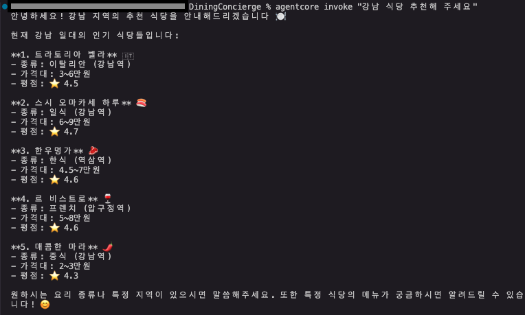
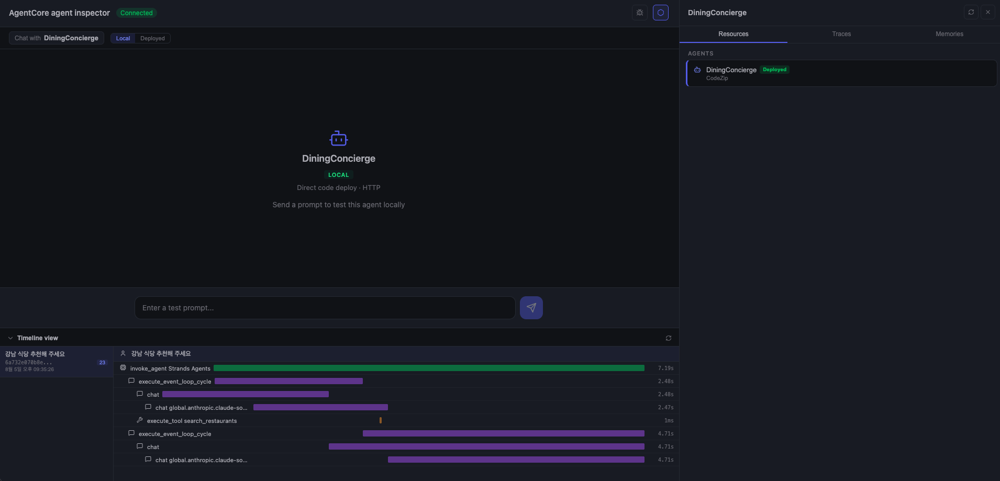
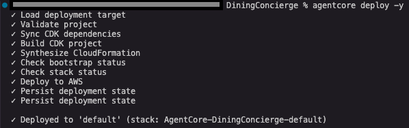
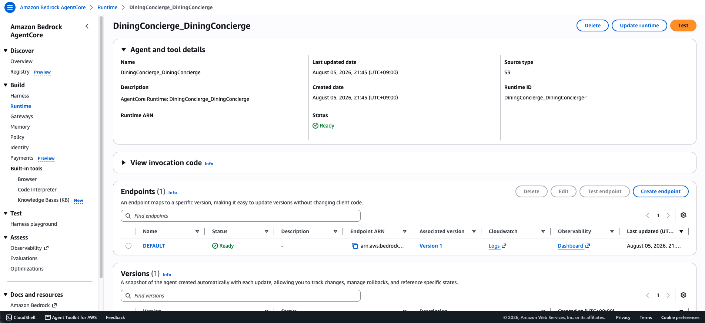
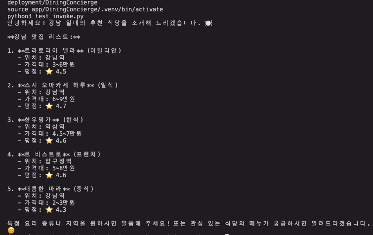
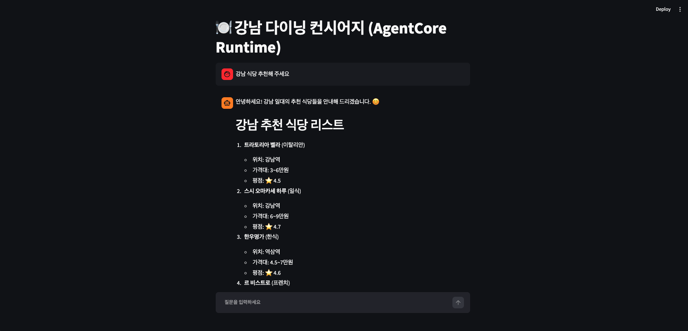

# 04-agentcore-deployment

AgentCore CLI로 다이닝 에이전트를 Runtime에 배포하고, CLI·boto3·Streamlit
세 경로로 호출을 검증하는 실습. 03-multiagent-collaboration에서 만든 식당
도구(search_restaurants, get_menu)를 관리형 엔드포인트로 올린다.

## 이 미션에서 다루는 것

1. AgentCore CLI로 프로젝트 생성 + 식당 도구 통합
2. Runtime 배포 → 콘솔에서 상태 Ready 확인
3. `agentcore invoke` / `test_invoke.py` / Streamlit 앱 세 경로 호출 검증

## 이 미션에서 다루지 않는 것

- 선언형(Harness) 배포 — 별도 미션
- Memory 연동 — 05번 미션
- check_reservations — 로컬 MCP 서버 의존이라 Runtime 배포 범위에서 제외

---

## 최초 1회 준비

### AgentCore CLI 설치 (Node.js 필요)

```bash
npm install -g @aws/agentcore-cli
agentcore --version
```

### AWS 자격 증명

us-west-2 리전에서 Bedrock + AgentCore Runtime 접근 가능한 자격 증명이
설정돼 있어야 한다. 워크숍 임시 자격 증명이 만료되면 갱신 필요.

---

## 1. 프로젝트 생성

```bash
cd ~/aws-training/labs/mission/04-agentcore-deployment
agentcore create --name DiningConcierge --framework Strands --model-provider Bedrock --memory none
```

생성된 프로젝트 구조:

```
DiningConcierge/
├── agentcore/
│   ├── agentcore.json      # 프로젝트 설정 (runtime, memory 등)
│   ├── aws-targets.json    # 배포 대상 (account + region)
│   └── .env.local          # 시크릿 (비어있음)
├── app/DiningConcierge/
│   ├── main.py             # 엔트리포인트 — @app.entrypoint + 식당 도구
│   ├── model/load.py       # BedrockModel 로딩
│   └── pyproject.toml      # 의존성
├── test_invoke.py          # boto3 호출 검증 스크립트
└── app.py                  # Streamlit 미니 앱
```

- `main.py`: `search_restaurants`, `get_menu` 두 도구를 `@tool`로 정의하고,
  `@app.entrypoint`로 에이전트 호출 엔드포인트를 노출. LRU 128 세션 캐시로
  동일 세션이면 대화 맥락 유지.
- `model/load.py`: `BedrockModel(model_id="global.anthropic.claude-sonnet-4-5-...")`
  로딩. Runtime에서는 IAM 역할로 인증.

---

## 2. 로컬 실행 (배포 전 검증)

```bash
cd ~/aws-training/labs/mission/04-agentcore-deployment/DiningConcierge
agentcore dev
```

`agentcore dev`가 로컬 에이전트를 띄우고 Inspector UI(localhost)를
브라우저에서 연다. 별도 터미널에서 CLI로 호출해 동작을 확인한다:

```bash
agentcore invoke "강남 식당 추천해 주세요"
```

5개 식당이 추천되고, 각 식당의 요리 종류·위치·가격대·평점이 반환된다:



Inspector UI에서 해당 세션의 지표를 확인할 수 있다. Timeline view에서
`search_restaurants` 도구 실행 시간(1ms)과 전체 응답 시간(7.19s),
이벤트 루프 사이클 2회(도구 호출 → 최종 응답 생성)가 시각화된다:



---

## 3. Runtime 배포

```bash
agentcore deploy -y
```

배포 과정: CDK 의존성 동기화 → CloudFormation 합성 → AWS 배포 →
상태 확인. `Deployed to 'default'` 메시지가 나오면 성공:



AWS 콘솔 > Bedrock > AgentCore > Build > Runtime에서
`DiningConcierge_DiningConcierge` 상태 **Ready**, Endpoint **DEFAULT**가
Ready인 것을 확인:



배포 후 출력된 Runtime ARN을 `test_invoke.py`에 반영해야 한다.

---

## 4. 호출 검증 — boto3 (`test_invoke.py`)

```bash
cd ~/aws-training/labs/mission/04-agentcore-deployment/DiningConcierge
source app/DiningConcierge/.venv/bin/activate
python3 test_invoke.py
```

`test_invoke.py`는 `boto3.client("bedrock-agentcore")`로
`invoke_agent_runtime`을 호출한다. 스트리밍 SSE 응답을 줄 단위로 파싱해
텍스트 델타를 이어붙여 최종 응답을 출력한다.

> **참고**: boto3가 필요하므로 `app/DiningConcierge/.venv`를 활성화한다.

배포된 Runtime에서 같은 5개 식당 추천 응답이 반환되는 것을 확인:



---

## 5. 호출 검증 — Streamlit 미니 앱 (`app.py`)

```bash
pip install streamlit    # venv에 streamlit 없으면 설치
streamlit run app.py
```

`app.py`는 `test_invoke.py`의 `invoke_agent` 함수를 임포트해서
`st.chat_input` + `st.chat_message` 패턴으로 감싼 것이다.

브라우저에서 "강남 식당 추천해 주세요" 입력 → 배포된 Runtime이 응답한
식당 리스트가 마크다운으로 렌더된다:



CLI·boto3·Streamlit 세 경로 모두 동일한 Runtime에서 같은 응답을 반환하는
것을 확인했다.

---

## 개선해볼 점

- **Streamlit 앱이 단발 질의만 처리함**: `app.py`가 `st.chat_input` +
  `st.chat_message`를 쓰고 있지만, 매 요청마다 새 `session_id`를 생성하므로
  대화 맥락이 이어지지 않는다. `st.session_state`에 `session_id`를 고정하고
  `invoke_agent`에 넘기면 Runtime 쪽의 LRU 캐시가 대화를 유지해준다.
  사이드바에 세션 초기화 버튼·대화 히스토리를 추가하면 02-strands-agent의
  최종 챗봇과 동일한 UX가 된다.

- **이전 미션에서 다뤘던 RAG·리랭킹·멀티에이전트 패턴이 미반영**:
  현재 `main.py`는 하드코딩된 식당 5곳만 반환한다. Knowledge Base를
  연결하면 검색 품질이 올라가고, 03번의 멀티에이전트 위임 패턴을
  Runtime에 올리면 복합 질의도 처리 가능하다. 다만 이는 05번(Memory·KB
  연동) 이후 미션에서 다루는 영역이라 여기서는 최소 도구만 배포했다.

- **AWS 서비스 확장 여지**: 식당 데이터를 DynamoDB에 넣고 Lambda로
  조회하면 하드코딩 제거 + 데이터 업데이트가 가능하다. Gateway Target을
  Lambda로 설정하면 AgentCore가 도구 호출을 Lambda로 라우팅해준다.
  다만 이후 미션에서 Gateway·Memory를 다루므로 여기서는 구현하지 않았다.
