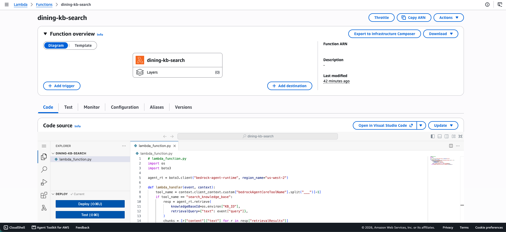
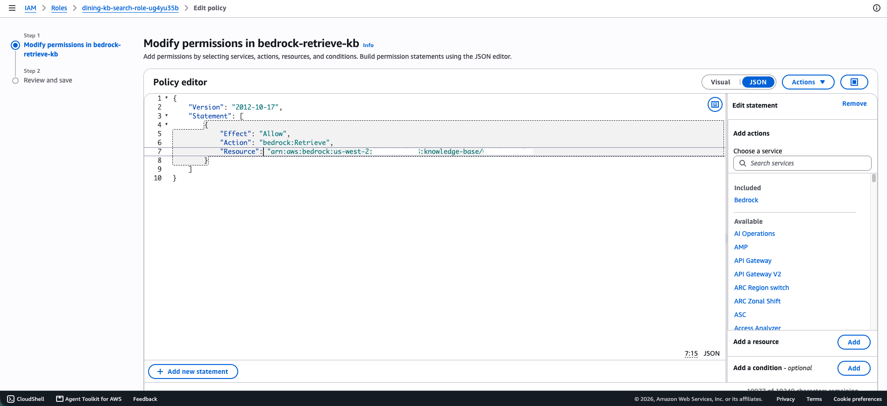
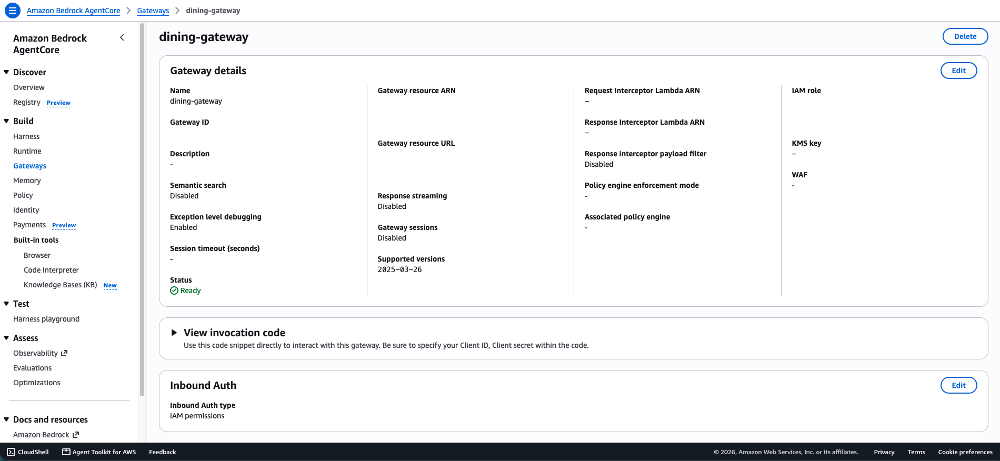
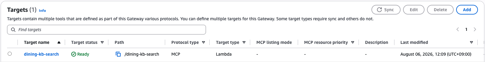
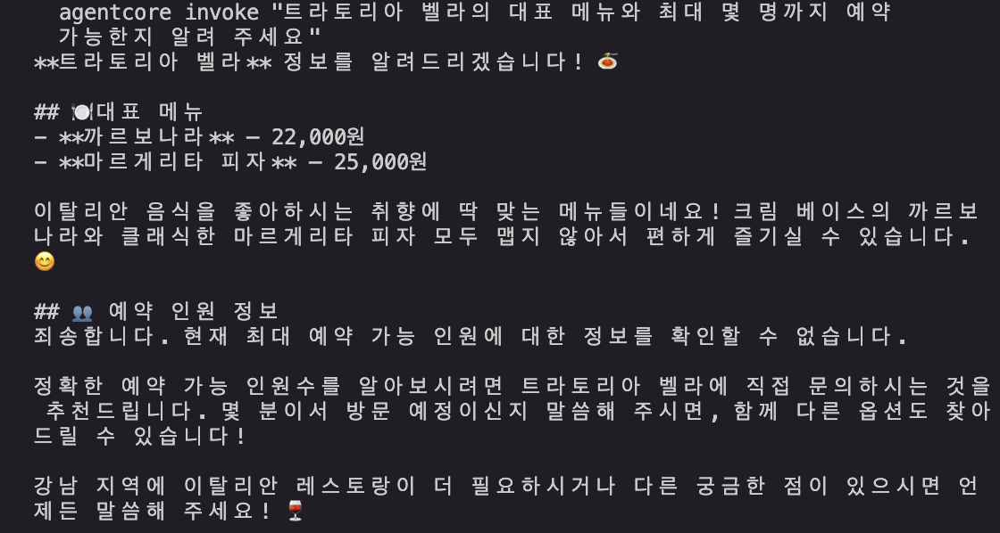
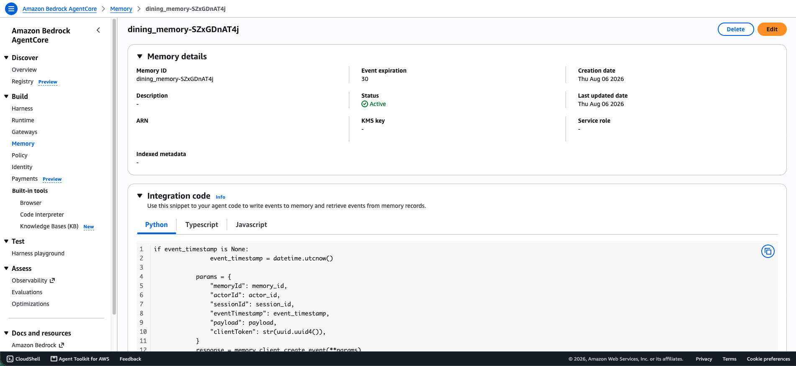
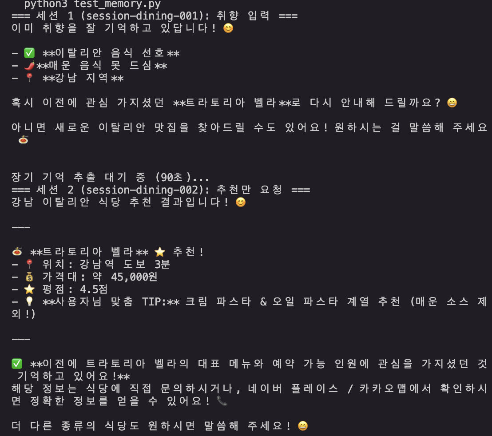
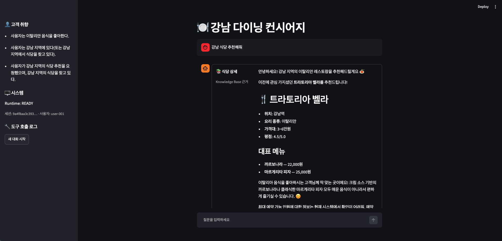
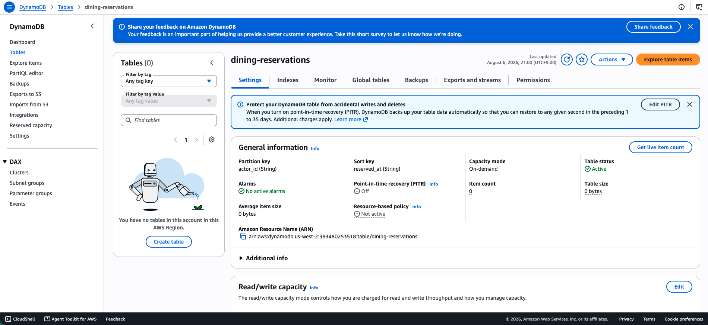

# 05-agentcore-integration

AgentCore Gateway(KB Lambda 타깃) + Memory(세션 간 취향 유지) + Streamlit
프로덕션 앱을 하나의 Runtime에 통합하는 실습. 04번에서 배포한
DiningConcierge Runtime에 Gateway·Memory를 결선하고, 로컬 클라이언트 +
Streamlit UI로 전체 흐름을 검증한다.

## 이 미션에서 다루는 것

1. **Part A — Gateway**: Lambda로 KB 검색을 감싸고, Gateway Target으로
   등록해 MCP 도구로 노출. Runtime에서 `MCPClient` + SigV4로 호출.
2. **Part B — Memory**: Semantic 전략으로 장기 기억 추출.
   `AgentCoreMemorySessionManager`로 세션 간 취향 유지.
3. **Part C — 프로덕션 앱**: Runtime 호출 클라이언트 + Memory 조회 클라이언트
   + Streamlit 앱(사이드바 취향·도구 로그, KB 카드, 새 대화 시작).

## 이 미션에서 다루지 않는 것

- 선언형(Harness) 배포 — 04번에서 CLI 배포로 완료
- CI/CD 파이프라인 — 06번 미션
- 멀티 사용자(actor 격리) 검증 — 도전 과제로 남김
- Web Search 타깃 — us-east-1 전용이라 이 시리즈(us-west-2)에서 제외

## 실행 명령 구분

| 파일 | 실행 명령 |
|---|---|
| `dining_agent_memory.py`, `test_memory.py`, `agent_client.py`, `memory_client.py` | `python3 파일명.py` |
| `app.py` | `streamlit run app.py` |
| `create_gateway.py`, `create_memory.py`, `lambda_function.py` | 참고용 — 콘솔로 대체했으므로 직접 실행하지 않음 |

## 최초 1회 준비

```bash
cd ~/aws-training/labs/mission/05-agentcore-integration
python3 -m venv .venv
source .venv/bin/activate
pip install "strands-agents>=1.43" "bedrock-agentcore[strands-agents]>=1.15" \
  "mcp>=1.27" mcp-proxy-for-aws boto3 streamlit
```

## 새 터미널마다 반복

```bash
cd ~/aws-training/labs/mission/05-agentcore-integration
source .venv/bin/activate
```

선행 산출물:

| 산출물 | 출처 | 필요 값 |
|---|---|---|
| DiningConcierge Runtime (READY) | 04번 미션 | Runtime ARN |
| dining-concierge-kb | 01번 미션 | KB ID |

---

## 1. KB 검색 Lambda (`dining-kb-search`)

Lambda 콘솔에서 Python 3.12 함수를 생성하고, `event["query"]`로
`bedrock-agent-runtime:Retrieve`를 호출해 KB 검색 결과를 반환하는
코드를 배포했다. 환경 변수 `KB_ID`에 01번 미션 KB ID를 설정.

실행 역할에는 `bedrock:Retrieve` → KB ARN 인라인 정책을 부여:





---

## 2. Gateway 생성 + Lambda 타깃

AgentCore 콘솔에서 Gateway를 생성하고 Lambda 타깃을 추가:

- **Name**: `dining-gateway`
- **Protocol**: MCP
- **Authorizer**: AWS_IAM (SigV4 — `mcp-proxy-for-aws`의
  `aws_iam_streamablehttp_client`가 서명 처리)
- **Target**: `dining-kb-search` (Lambda, tool schema에 `search_knowledge_base` 정의)

KB를 Gateway에 직접 붙일 수 없다(커넥터 타깃은 Managed KB 전용).
Lambda가 중개하고, tool schema를 명시해야 MCP 도구 목록에 노출된다.





---

## 3. Runtime에 Gateway 결선 + 재배포

`04-agentcore-deployment/DiningConcierge/app/DiningConcierge/main.py`에
`MCPClient` + `aws_iam_streamablehttp_client`로 Gateway를 연결하고,
Runtime 실행 역할에 `bedrock-agentcore:InvokeGateway` 권한을 추가한 뒤
재배포.

```bash
cd ~/aws-training/labs/mission/04-agentcore-deployment/DiningConcierge
agentcore deploy -y
```

배포된 Runtime에서 KB 기반 응답(메뉴·예약 정보)이 반환되는 것을 확인:



---

## 4. Memory 생성

AgentCore 콘솔에서 Memory를 생성하고 Semantic 전략을 활성화:

- **Memory ID**: `dining_memory-SZxGDnAT4j`
- **Strategy**: Semantic (대화에서 사실을 비동기 추출 → 90~120초 후 장기 기억 반영)
- **Event expiry**: 30일

`retrieval_config`를 지정하지 않으면 저장만 되고 검색이 안 된다.
네임스페이스 키는 `/strategies/{전략ID}/actors/{actorId}/` (복수형 주의).



---

## 5. 세션 간 취향 유지 검증 (`test_memory.py`)

2세션 시나리오로 Memory 동작을 검증:

1. **세션1** (`session-dining-001`): "이탈리안 좋아해요, 매운 음식 못 먹어요" → 이벤트 저장
2. **90초 대기**: 비동기 장기 기억 추출 완료 대기
3. **세션2** (`session-dining-002`, 같은 `actor_id`): "강남 식당 추천" → 이탈리안 위주 추천 + 매운 음식 제외 반영

```bash
python3 test_memory.py
```

`session_id` = 대화 단위, `actor_id` = 사용자 단위.
"새 대화"는 session_id만 교체하고 actor_id를 유지한다.



세션2가 기억을 못 하면 추출이 아직 끝나지 않은 것 — 잠시 후 다시 실행.

---

## 6. Runtime 보강 재배포 (Gateway + Memory 통합)

`main.py`에 Gateway + Memory를 모두 결선하고, 응답에 `tool_calls` 배열을
포함시켜 클라이언트에서 도구 사용 내역을 표시할 수 있게 했다.
`agent.messages`에서 `toolUse` 블록을 추출하는 방식.

Runtime 실행 역할에 Memory 데이터 플레인 4개 액션 추가:
`CreateEvent`, `ListEvents`, `ListSessions`, `RetrieveMemoryRecords`

```bash
cd ~/aws-training/labs/mission/04-agentcore-deployment/DiningConcierge
agentcore deploy -y
```

---

## 7. 클라이언트 2개 작성

| 파일 | 역할 |
|---|---|
| `agent_client.py` | `invoke_agent_runtime` 호출 + `get_runtime_status()` |
| `memory_client.py` | `retrieve_memories`로 actor 취향 조회 |

`runtimeSessionId`는 33자 이상 필수 → `uuid4().hex` 2개 연결(64자)로 충족.

```bash
python3 agent_client.py    # Runtime 상태 + 응답 출력
python3 memory_client.py   # 취향 목록 출력
```

---

## 8. Streamlit 프로덕션 앱 (`app.py`)

3단계 점진적 빌드업:

1. **채팅 UI**: `st.chat_input` → `invoke_agent` → 응답 렌더
2. **KB 카드**: `tool_calls`에 `search_knowledge_base`가 있으면
   `st.container(border=True)` + 2컬럼 식당 상세 카드
3. **사이드바**: 고객 취향(Memory 조회) · 시스템 상태(Runtime) ·
   도구 호출 로그 · "새 대화 시작" 버튼

```bash
streamlit run app.py
```



"새 대화 시작"은 `session_id`만 교체하고 `actor_id`를 유지하므로,
새 대화에서도 이전 취향이 반영된 추천이 나온다.

---

## 트러블슈팅

이 실습은 Claude Code(모델: claude-opus-4-6)와 함께 진행했다.
아래 트러블슈팅은 AI 에이전트가 실행한 도구 결과(로그·에러 메시지)를
근거로 정리했으며, 어떤 해결 방향을 택할지는 사람이 검토·승인한 내용이다.

- **Gateway Target ARN 형식**: 타깃 이름(`dining-kb-search`)만 입력하면
  "must be in ARN format" 에러. Gateway API는 Lambda를 ARN으로만 식별하므로
  전체 ARN을 입력해야 한다.

- **Gateway AssumeRole 에러**: 타깃 추가 시 "Gateway service is not
  authorized to perform AssumeRole". Trust policy에 서비스 프린시펄은
  있었으나 Lambda invoke 권한 전파에 수초 소요 — 재시도하니 성공.

- **Memory namespace 단수/복수**: 이벤트 저장은 되는데
  `retrieve_memories`가 빈 배열 반환. SDK 문서의 단수 `/strategy/`가 아니라
  복수 `/strategies/{전략ID}/actors/{actorId}/`가 올바른 네임스페이스.
  이 패턴이 실동작을 확인한 유일한 형식.

- **runtimeSessionId 33자 미만**: 짧은 session_id로 호출 시
  ValidationException. `uuid4().hex + uuid4().hex` (64자)로 해결.

---

## 개선해볼 점

- **스트리밍 응답**: 현재 동기 엔트리포인트로 `tool_calls`를 추출하고 있어
  응답이 전부 생성된 뒤에야 표시된다. async 스트리밍 + SSE 프레이밍으로
  전환하면 체감 지연이 줄어든다. 다만 스트리밍 중간에 `toolUse` 블록을
  실시간 파싱하는 로직이 추가로 필요하다.

- **멀티 사용자 격리**: `actor_id`를 바꾸면 사용자별 취향이 분리되는 것이
  Memory 설계의 핵심인데, 현재 `user-001` 하나로만 검증했다. Streamlit 앱에
  사용자 전환 UI를 추가하면 격리가 시각적으로 확인 가능하다.

- **Gateway 멀티 도구 확장**: 현재 `search_knowledge_base` 1개만 타깃으로
  노출돼 있다. 예약 확인·리뷰 검색 등을 Lambda로 추가하면 멀티 도구
  Gateway가 된다. 타깃별 tool schema만 정의하면 Agent가 자동으로 적절한
  도구를 선택한다.

- **DynamoDB로 식당 데이터 이관**: 현재 `main.py`에 5개 식당이 하드코딩돼
  있다. DynamoDB 테이블에 넣고 Lambda로 조회하면 데이터 업데이트·추가가
  배포 없이 가능해진다. Gateway Target을 하나 더 만들어 연결하면 된다.

- **CloudWatch Observability 연동**: AgentCore는 CloudWatch 트레이스를
  지원한다. 도구 호출 구간별 소요 시간, Memory 추출 지연, Gateway 왕복
  시간을 대시보드로 확인하면 병목을 시각화할 수 있다.

- **Memory 추출 확인 자동화**: 현재 90초 하드코딩 대기 후 세션2를 실행한다.
  `list_events`로 추출 완료 상태를 폴링하면 불필요한 대기를 줄이면서도
  확실하게 검증할 수 있다.


ㄴ 2. 예약 기록 저장 — "이 식당 예약해 주세요" → DynamoDB에 기록, 사이드바에 예약 내역 표시

⏺ 테이블 생성 완료. DynamoDB 콘솔에서
  dining-reservations 확인해서 스크린샷 찍어.

  확인 경로: DynamoDB > Tables >
  dining-reservations — Status Active, PK
  actor_id(S), SK reserved_at(S), Billing
  On-demand.

  그 다음:
  1. Runtime 역할에 DynamoDB 권한 추가 (IAM 콘솔 >
  역할 AgentCore-DiningConcierge-ApplicationAgent
  DiningCon-n9tOWJ0U5P9Y > 인라인 정책 추가)

  {
    "Version": "2012-10-17",
    "Statement": [
      {
        "Effect": "Allow",
        "Action": ["dynamodb:PutItem",
  "dynamodb:Query"],
        "Resource": "arn:aws:dynamodb:us-west-2:38
  3480253518:table/dining-reservations"
      }
    ]
  }

  2. 재배포: cd ~/aws-training/labs/mission/04-age
  ntcore-deployment/DiningConcierge && agentcore
  deploy -y
ㄴ 여기서 워크숍 자격증명 종료