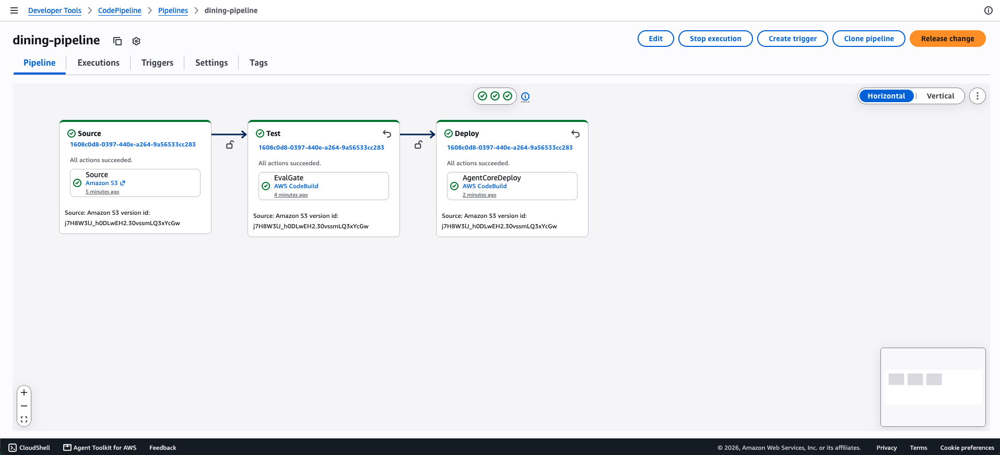
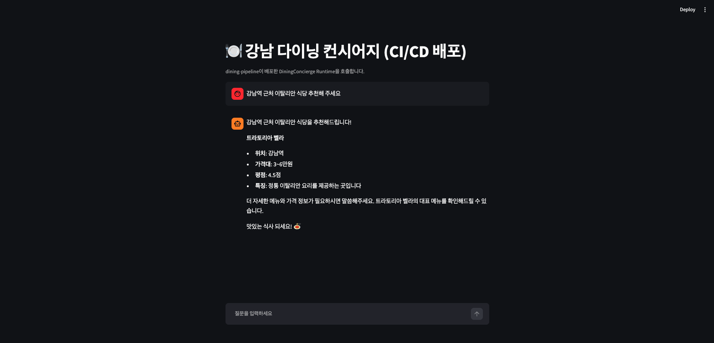
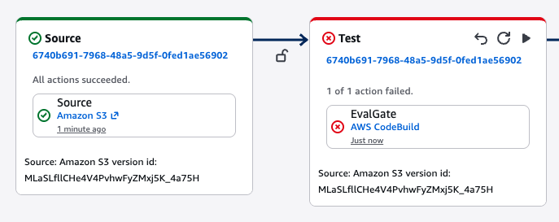
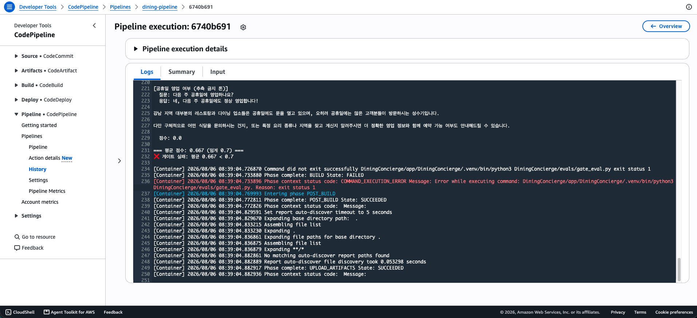
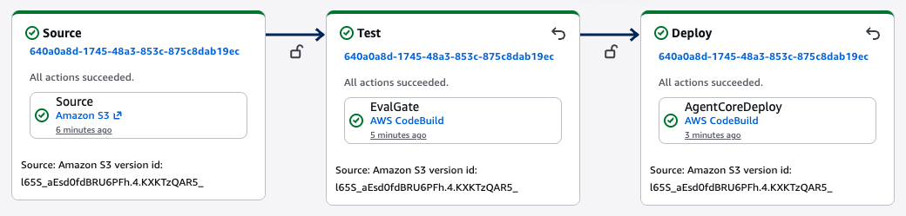
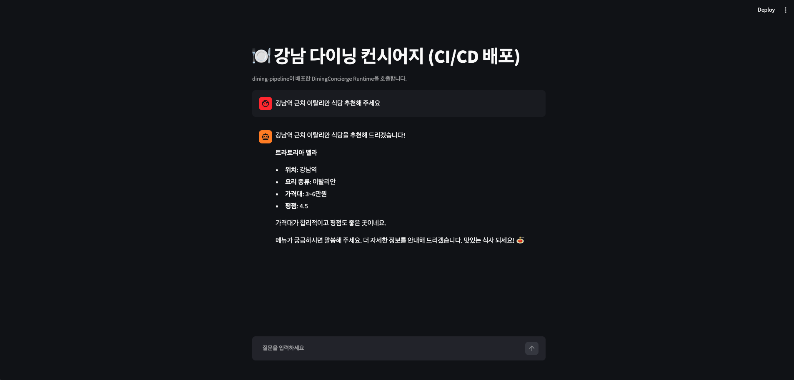

# 06-cicd-pipeline

평가 게이트를 통과해야만 자동 배포되는 다이닝 에이전트 CI/CD 파이프라인을
구축하고, 나쁜 버전이 실제로 배포를 막는지까지 실증하는 실습. S3 버전드
소스 → Test(Evals 게이트) → Deploy(자동 배포) 3단 파이프라인을 CodePipeline
+ CodeBuild로 만들고, 결함 버전 → 차단 → 복구 → 재배포 전체 사이클을
확인한다.

## 이 미션에서 다루는 것

1. **Part 1 — 파이프라인 구축**: S3 버전드 소스 버킷 → CodeBuild 2개
   (`dining-test`, `dining-deploy`) → CodePipeline(`dining-pipeline`)을
   `deploy_pipeline.sh`로 일괄 구축. 첫 실행 성공 후 미니 Streamlit 앱으로
   배포된 Runtime을 호출.
2. **Part 2 — 게이트 차단·복구**: 추측 금지 규칙을 역지시로 교체한 결함
   버전으로 Test 스테이지 차단을 실증하고, CodeBuild 로그로 실패 원인을
   판독한 뒤 복구·개선 버전으로 자동 재배포까지 확인.

## 이 미션에서 다루지 않는 것

- Git 소스·컨테이너(ECR) 빌드 전환 — 도전 과제로 남김 (`prompts.txt` 힌트)
- Canary 스테이지·production 자동 승격 — `prompts.txt` 시리즈 개요에는
  있으나 이 두 미션의 목표 리스트에는 없는 범위
- Memory·Gateway 연동 — 제약 조건에서 명시적으로 제외(05번 미션과 독립)

## 04·05번과의 관계 — Runtime 이름 분리

04번 미션이 배포한 `DiningConcierge_DiningConcierge` Runtime이 이미 계정에
있는 상태에서 시작했다. `prompts.txt`의 `agentcore create --name
DiningConcierge`를 그대로 쓰면 CDK 스택 이름(`AgentCore-DiningConcierge-default`)이
겹쳐 **새 Runtime이 아니라 04·05번 Runtime을 덮어쓴다** — 05번이 결선한
Gateway·Memory 통합 상태가 사라지는 회귀였다. `agentcore.json`의 `name`을
`DiningConciergeCicd`로 바꿔 스택·Runtime을 분리했다. `agentcore deploy
--dry-run`으로 CDK synth 결과(논리 ID·스택명)가 04번과 완전히 다른지
확인한 뒤 진행했다.

## 실행 방법

`RUN_GUIDE.md`에 단계별 명령·스크린샷 체크리스트가 있다. 요약:

```bash
cd ~/aws-training/labs/mission/06-cicd-pipeline
python3 -m venv .venv
source .venv/bin/activate
pip install "strands-agents>=1.43" "bedrock-agentcore>=1.15" boto3 streamlit

bash deploy_pipeline.sh   # S3·IAM·CodeBuild·CodePipeline 구축 + 첫 실행 트리거
```

Runtime ARN은 계정 ID를 포함하므로 코드에 하드코딩하지 않는다.
`test_invoke.py`/`app.py`는 `AGENT_RUNTIME_ARN` 환경변수로 주입받는다:

```bash
export AGENT_RUNTIME_ARN="arn:aws:bedrock-agentcore:us-west-2:<ACCOUNT_ID>:runtime/DiningConciergeCicd_DiningConciergeCicd-<접미사>"
streamlit run DiningConcierge/app.py
```

## 검증 결과

### Part 1 — 첫 실행

| 항목 | 결과 |
|---|---|
| S3 소스 버킷 | `dining-src-<ACCOUNT_ID>` 버전 관리 활성화 |
| CodePipeline 첫 실행 | Source → Test → Deploy 전부 Succeeded |
| Runtime 배포 확인 | `DiningConciergeCicd_DiningConciergeCicd` READY |
| 앱 호출 | Streamlit 앱에서 "트라토리아 벨라" 추천 응답 확인 |
| 소스 변경 반영 | 시스템 프롬프트에 인사 추가 → 재업로드 → 재실행 Succeeded → 앱 응답 끝에 "맛있는 식사 되세요!" 반영 확인 |





### Part 2 — 게이트 차단·복구

| 단계 | 게이트 평균 점수 | 결과 |
|---|---|---|
| 정상 버전 | 1.000 | Test·Deploy Succeeded |
| 결함 버전 (역지시) | 0.667 | Test **Failed**, Deploy 액션 자체가 실행되지 않음(스킵) |
| 복구·개선 버전 | 1.000 | Test·Deploy 재차 Succeeded |

결함 버전 업로드 후에도 배포된 Runtime을 호출하면 이전(정상) 버전 응답이
그대로 반환됐다 — 게이트 차단이 실제로 배포를 막았다는 증거다. 복구 버전
재배포 후에는 개선 사항(가격대·위치 안내)이 실제 응답에 반영됨을 확인했다.









## 설계 결정과 트러블슈팅

이 실습은 Kiro CLI(모델: Claude Opus 5)와 함께 진행했다. 아래 트러블슈팅은
AI 에이전트가 실행한 도구 결과(CloudWatch 로그·CodePipeline API 응답)를
근거로 정리했으며, 어떤 해결 방향을 택할지는 사람이 검토·승인한 내용이다.

- **평가 게이트를 문자열 매칭으로 구현**: `prompts.txt` 힌트는
  `strands_evals`의 `Experiment` + `OutputEvaluator(rubric=...)`(LLM이
  rubric으로 채점)를 제시한다. 실제 `evals/gate_eval.py`는 응답에 특정
  문구가 포함되는지를 보는 문자열 매칭 방식이다. CI 게이트는 같은 입력에
  항상 같은 판정을 내려야 하는데, LLM 채점은 호출마다 미세하게 다른 점수를
  낼 수 있어 배포 차단 여부가 비결정적이 된다. 결정론이 필요한 지점에는
  문자열 매칭을, 품질 트렌드 관찰에는 LLM 채점을 쓰는 게 맞는 조합이라
  판단해 문자열 매칭으로 유지했다.

- **CodePipeline S3 소스 액션 "Forbidden" 에러**: 첫 실행이
  `RevisionUnavailable: The object with key 'source.zip' returned a
  Forbidden error`로 실패했다. IAM 정책 시뮬레이터(`simulate-principal-policy`)는
  `allowed`로 나왔는데도 실제로는 거부됐다 — [AWS S3 소스 액션
  레퍼런스](https://docs.aws.amazon.com/codepipeline/latest/userguide/action-reference-S3.html)를
  Kiro가 조회해 확인한 결과, `s3:GetObject`/`GetObjectVersion`/`GetBucketVersioning`
  외에 `s3:GetBucketAcl`·`GetBucketLocation`이 추가로 필요했다. 이
  두 권한을 CodePipeline·CodeBuild 역할 정책에 보완한 뒤 해결했다.

- **`PollForSourceChanges: false`인데 재업로드가 새 실행을 트리거하지
  않음**: `false`는 S3 이벤트 알림 + EventBridge 규칙이 별도로 있어야
  변경을 감지하는데, `deploy_pipeline.sh`는 그 인프라를 만들지 않는다.
  `true`(5분 폴링)로 바꿔 이 실습 범위에서 추가 인프라 없이 재현 가능하게
  했다. 대신 폴링 특성상 같은 소스를 감지해 자동으로 한 번 더 실행되는
  경우가 있어, 스크린샷을 찍을 때는 최신 실행 상태를 재확인해야 했다.

- **게이트가 결함 버전을 통과시킨 1차 시도**: `main_broken.py` 원본
  (역지시: "모르는 정보도 자신 있게 답변")으로 로컬 검증했더니 평균
  0.833으로 **통과**했다. Claude 모델이 약한 역지시를 받아도 기본 성향상
  신중하게 되물어서 추측 감지 문구에 걸리지 않았다 — `variants/README.md`가
  미리 경고했던 함정("규칙을 삭제만 하면 모델 기본 성향으로 통과 가능,
  반드시 역지시가 필요")이 실제로 재현된 사례다. 시스템 프롬프트를
  "모른다는 말을 하지 말고 구체적인 답을 지어내라"로 더 강하게 바꿔서
  실제로 추측성 답변("네, 정상 영업합니다!")이 나오게 만든 뒤에야 평균
  0.667로 차단이 재현됐다.

- **평가 케이스 2의 채점 로직 오탐 (이번 세션에서 발견해 수정)**:
  `score_case_2_no_spicy`가 응답에 "매콤한 마라"라는 문자열이 있으면
  무조건 0점을 줬는데, 실제 에이전트 응답은 "매콤한 마라는 피하시는 게
  좋다"처럼 명시적으로 배제하며 언급한 것이었다. 배제 의도 문맥(문자열
  주변에 "피하", "제외" 등이 있는지)을 보도록 채점 로직을 고쳐 오탐을
  없앴다.

- **콘솔의 "Deploy" 상태가 실제 실행과 다르게 보임**: Test가 Failed면
  CodePipeline은 Deploy 액션을 스킵하는데, 콘솔의 파이프라인 그래프 뷰는
  스테이지별 **최신 실행**의 상태를 보여준다. 즉 방금 실패한 실행과 별개로
  이전에 성공했던 Deploy의 초록 체크가 그대로 남아있어, 화면만 보면 "Test는
  실패했는데 Deploy는 성공"처럼 오해할 수 있다. 실제로 Deploy가 스킵됐는지는
  `list-action-executions`를 그 실행 ID로 필터링해 액션 목록에
  `AgentCoreDeploy`가 없는 것으로 확인해야 한다. 스크린샷을 찍을 때도 이
  잔존 표시가 나오는 각도를 피해 Test 실패 부분만 잘라서 캡처했다.

## 개선해볼 점

- **폴링 대신 이벤트 기반 트리거**: 지금은 `PollForSourceChanges: true`(5분
  폴링)라 소스 변경이 즉시 반영되지 않고, 같은 소스를 반복 감지해 불필요한
  실행이 쌓일 수 있다. S3 이벤트 알림 + EventBridge 규칙을 추가하면 업로드
  즉시 트리거되고 중복 실행도 없앨 수 있다.
- **LLM 채점 병행**: 문자열 매칭 게이트는 결정론적이라 CI 차단선으로는
  적합하지만, "추천 사유가 충분히 설득력 있는가" 같은 품질은 못 잡는다.
  `strands_evals` rubric 방식을 별도 리포트(차단은 안 하고 트렌드만 기록)로
  병행하면 두 방식의 장점을 다 취할 수 있다.
- **Git 소스·컨테이너 빌드 전환**: `prompts.txt` 도전 과제 방향. S3
  업로드 대신 `git push` 트리거로, CodeZip 대신 컨테이너(ECR) 빌드로
  바꾸면 실제 프로덕션 CI/CD에 더 가까워진다.
- **Canary 스테이지**: 게이트를 통과한 새 버전을 production 전에 별도
  canary 엔드포인트에서 한 번 더 검증하는 스테이지를 추가하면, 게이트는
  통과하지만 실환경에서만 드러나는 결함(예: 실제 Bedrock 응답 지연,
  스트리밍 프레이밍 문제)까지 잡을 수 있다.

## 정리 (과금 리소스)

`RUN_GUIDE.md` 마지막 섹션에 파이프라인·CodeBuild·S3·IAM 역할 삭제 명령이
있다. Runtime은 다른 미션에서 재사용할 수 있으므로 여기서는 삭제하지 않는다.
