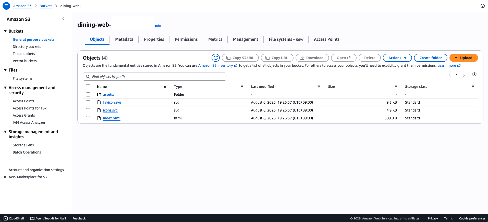
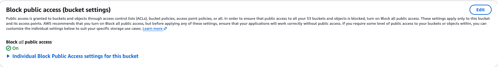
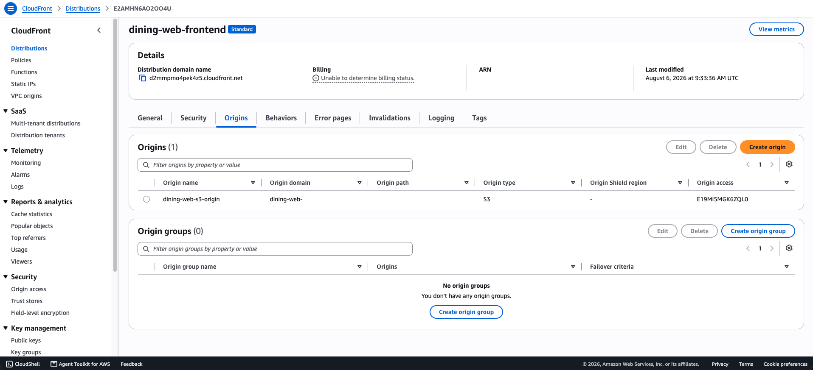
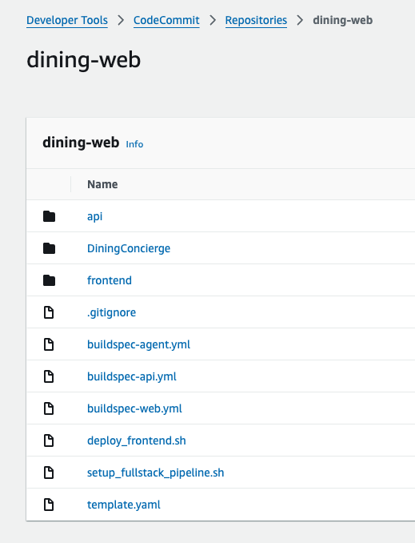
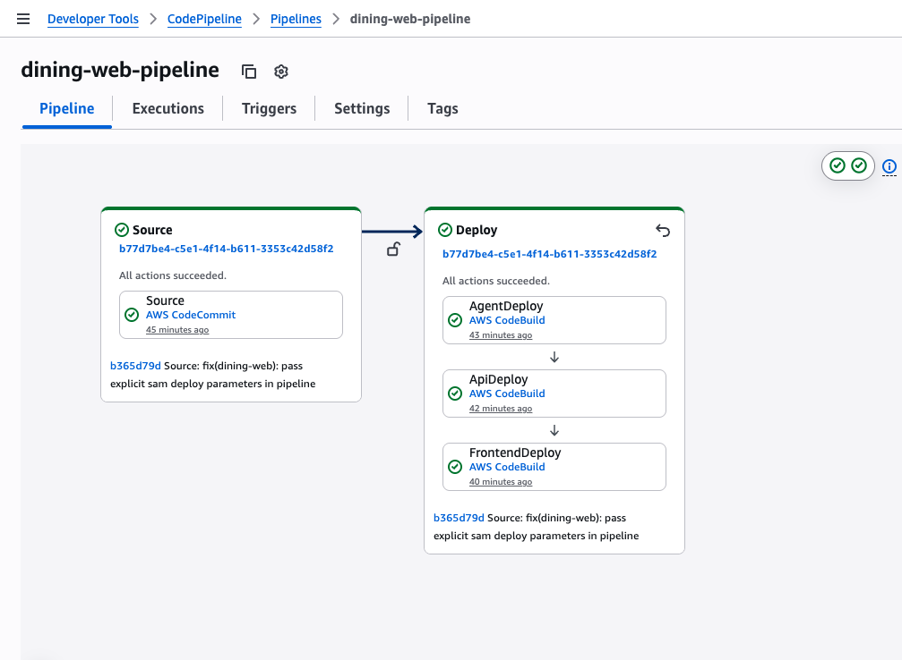
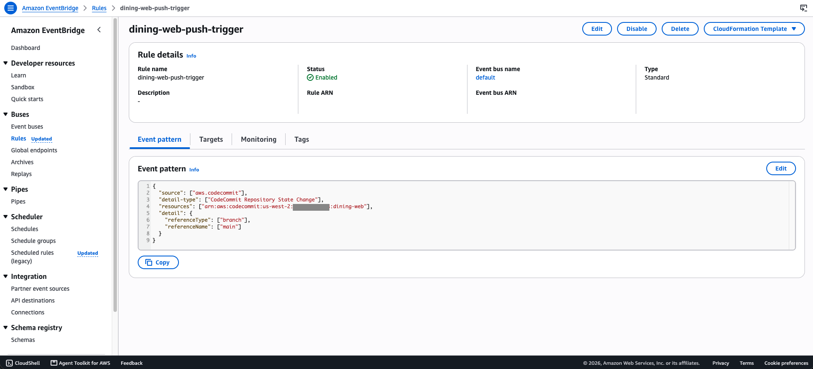

# 07-dining-web-service

AgentCore Runtime에 배포된 다이닝 에이전트를 AWS 자격 증명 없이 누구나
브라우저로 쓸 수 있는 서비스로 만드는 실습. SAM 서버리스 API → Cloudscape
채팅 프론트엔드 → CloudFront 정적 호스팅 → CodeCommit·CodePipeline 풀스택
CI/CD까지 4단계로 쌓아 올린다.

> `prompts.txt`는 작업 경로를 `labs/dining-web/`으로 지시하지만, 이 리포는
> 미션 산출물을 `labs/mission/<미션 번호>-<이름>/` 아래에 둔다(미션 01~03도
> 프롬프트가 지시한 `labs/mission-*` 경로 대신 미션 폴더 하위에 있다).
> 아래 명령의 경로는 이 폴더 기준으로 고쳐 적었다. SAM 스택 이름
> (`dining-web`)과 CodeCommit 리포 이름은 프롬프트 제약대로 유지한다.

## 이 미션에서 다루는 것

1. **SAM 서버리스 API** — `template.yaml`(명시적 `AWS::Serverless::HttpApi`,
   Lambda 1개, `Timeout: 60`)로 `GET /`(임시 확인용 채팅 페이지)·
   `POST /ask`(에이전트 호출) 두 라우트를 배포.
2. **Cloudscape 채팅 프론트엔드** — Vite+React에 `@cloudscape-design/*`
   3패키지로 `ChatBubble`+`PromptInput` 채팅 UI를 만들고 로컬 dev 서버에서
   CORS를 열어 실대화.
3. **CloudFront 정적 호스팅** — 프로덕션 빌드를 비공개 S3 버킷에 올리고
   CloudFront(OAC)로 공개. 캐시 무효화 갱신 루프까지 체험.
4. **풀스택 파이프라인** — 에이전트·API·프론트엔드를 한 CodeCommit
   모노레포로 묶고, push 한 번으로 3계층이 순서대로(RunOrder 1·2·3)
   자동 배포되는 CodePipeline 완성.

## 아키텍처

```
사용자 → CloudFront(OAC) → S3(비공개, 정적 프론트)
       → HTTP API + Lambda → AgentCore Runtime(DiningConcierge)

개발자 → git push → CodeCommit(dining-web, main)
       → EventBridge → CodePipeline(dining-web-pipeline)
       → Deploy 스테이지: AgentDeploy(1) → ApiDeploy(2) → FrontendDeploy(3)
```

에이전트는 04번 미션에서 배포한 `DiningConcierge_DiningConcierge` Runtime을
그대로 사용한다(재배포가 아니라 같은 Runtime을 파이프라인이 계속 관리하는
구조 — 04번 미션의 스택을 CodeBuild가 업데이트한다).

## 실행 방법

### 1. SAM API 배포

```bash
# 로컬 python3.13이 있어야 sam build가 성공한다(함수 런타임과 로컬
# 인터프리터 버전이 같아야 함).
brew install python@3.13
export PATH="/opt/homebrew/opt/python@3.13/libexec/bin:$PATH"

cd labs/mission/07-dining-web-service
sam build
sam deploy --stack-name dining-web --region us-west-2 \
  --parameter-overrides AgentRuntimeArn=<04번 미션 Runtime ARN> \
  --capabilities CAPABILITY_IAM --resolve-s3 \
  --no-confirm-changeset --no-fail-on-empty-changeset
```

출력된 `ApiUrl`에 `/Prod/`를 붙여 브라우저로 연다(SAM 기본 스테이지 이름이
`Prod`라 출력 URL 그대로는 라우트가 안 잡힌다).

### 2. Cloudscape 프론트엔드 (로컬)

```bash
cd frontend
npm install
echo "VITE_API_URL=<ApiUrl>/Prod" > .env.local   # 끝 슬래시 제외
npm run dev
```

### 3. CloudFront 정적 호스팅

```bash
echo "VITE_API_URL=<ApiUrl>/Prod" > frontend/.env.production
cd frontend && npm run build && cd ..
aws s3 sync frontend/dist/ s3://dining-web-<ACCOUNT_ID>/
# CloudFront 배포는 OAC로 S3 오리진을 연결해 콘솔 위저드로 생성
```

### 4. 풀스택 파이프라인

```bash
pip install git-remote-codecommit
aws codecommit create-repository --repository-name dining-web --region us-west-2
git remote add origin codecommit::us-west-2://dining-web
git push -u origin main
# CodeBuild 3개 + CodePipeline(Deploy 스테이지 3액션, RunOrder 1·2·3) 생성 후
# 이후로는 git push만으로 자동 배포된다.
```

## 검증 결과

| 단계 | 확인 내용 | 결과 |
|---|---|---|
| SAM API | `POST /Prod/ask`에 이탈리안 질문 | 트라토리아 벨라 포함 응답 |
| Cloudscape 프론트 | 로컬 dev 서버(`localhost:5173`)에서 CORS preflight | `access-control-allow-origin` 허용 확인 |
| CloudFront | `https://<배포 도메인>/` | 채팅 페이지 렌더, 실대화 성공 |
| 갱신 루프 | 문구 수정 → 빌드 → 업로드 → 무효화 전/후 | 무효화 전 옛 캐시 확인 → 무효화 후 반영 확인 |
| 풀스택 파이프라인 | 한 커밋(buildspec 수정+에이전트 인사+프론트 제목) push | AgentDeploy→ApiDeploy→FrontendDeploy 전부 Succeeded, push만으로 자동 트리거 |
| 풀스택 반영 | CloudFront 새 제목 + 에이전트 응답 끝 인사 | "강남 다이닝 컨시어지 — 풀스택 파이프라인" + "맛있는 식사 되세요!" 둘 다 확인 |

### S3 정적 자산 (미션 3)





### CloudFront 배포 (미션 3)



### 풀스택 파이프라인 (미션 4)







> 챗봇 UI(사이드바 대화 목록, 하단 고정 입력창, 마크다운 렌더링,
> 라이트/다크 모드 토글)는 실제 웹 서비스 형태로 개선을 마쳤다.

## 설계 결정과 트러블슈팅

이 실습은 Kiro CLI(모델: Claude Opus 5)와 함께 진행했다. 아래 트러블슈팅은
AI 에이전트가 실행한 도구 결과(CodeBuild 로그·CloudFormation 이벤트)를
근거로 정리했으며, 어떤 해결 방향을 택할지는 사람이 검토·승인한 내용이다.

- **`sam build`가 로컬 Python 3.13을 요구**: 로컬에 Python 3.14만 설치돼
  있어 `PythonPipBuilder:Validation` 에러로 실패했다. `prompts.txt`가 이미
  경고한 함정("sam build가 함수 런타임과 같은 버전의 로컬 인터프리터를
  요구")이 실제로 재현된 사례다. `brew install python@3.13` 후 `PATH`에
  추가해 해결했다. Docker가 있었다면 `sam build --use-container`로
  우회할 수도 있었다.

- **`CorsConfiguration`의 플레이스홀더가 API Gateway 배포를 실패시킴**:
  `<YOUR_CLOUDFRONT_DOMAIN>` 플레이스홀더를 `AllowOrigins`에 그대로 둔 채
  1단계에서 배포하면 `Invalid format for origin` 에러로 스택 생성 자체가
  실패한다. 아직 만들어지지 않은 CloudFront 도메인은 빼고 배포한 뒤, 3단계
  에서 실제 도메인이 생기면 추가하는 순서로 진행했다.

- **CodeBuild 컨테이너에서도 python3.13 문제가 재현됨**: 로컬에서 해결한
  뒤 `buildspec-api.yml`에는 `runtime-versions: python`을 명시하지 않아
  CodeBuild 컨테이너의 기본 Python으로 같은 에러가 재발했다.
  `runtime-versions`에 `python: 3.13`을 명시해 해결했다.

- **`sam deploy`가 `samconfig.toml` 부재로 실패**: 로컬에서
  `sam deploy --guided` 없이 커맨드라인 파라미터로만 첫 배포를 했기 때문에
  `samconfig.toml`이 생성되지 않았다. CodeBuild가 이 설정 파일 없이
  `sam deploy --no-confirm-changeset ...`만 실행하면 `--stack-name` 등
  필수 옵션이 빠져 실패한다. `buildspec-api.yml`에 `--stack-name`·
  `--parameter-overrides`·`--capabilities`·`--resolve-s3`를 명시적으로
  넣어 `samconfig.toml`에 의존하지 않게 했다. `AgentRuntimeArn`은 계정
  ID를 포함하므로 buildspec에 하드코딩하지 않고 CodeBuild 프로젝트의
  환경 변수(`AGENT_RUNTIME_ARN`)로 주입했다.

- **`aws-targets.json`을 커밋할 수 없어 CodeBuild가 배포 대상을 못 찾음**:
  이 파일은 계정 ID를 포함해 `.gitignore` 대상인데, `agentcore deploy`는
  CDK가 이 파일이 없으면 `No deployment targets configured` 에러로
  즉시 실패한다(`agentcore/cdk/bin/cdk.ts`의 `readAWSDeploymentTargets`
  검증). `buildspec-agent.yml`의 `pre_build` 단계에서
  `aws sts get-caller-identity`로 계정 ID를 조회해 매 빌드마다 이 파일을
  동적으로 생성하도록 고쳤다 — 06번 미션에서 로컬 CLI가 자동 생성해주던
  역할을 CI 환경에서는 buildspec이 대신해야 한다.

- **CodePipeline 위저드 없이 CLI로 만들 때 EventBridge 트리거가 자동 생성
  안 됨**: `prompts.txt`는 콘솔 위저드가 EventBridge 규칙을 자동으로
  만들어준다고 안내하는데, CLI로 `create-pipeline`만 호출하면 이 규칙이
  생기지 않아 `PollForSourceChanges: false`인 소스가 push에 반응하지
  않는다. `aws events put-rule`(CodeCommit 리포지토리 상태 변경 이벤트) +
  `put-targets`(파이프라인 ARN)로 직접 구성했다. 이후 실제 `git push`가
  파이프라인을 자동 시작시키는 것을 확인했다.

- **Cloudscape UI가 Vite 기본 스캐폴딩 스타일과 충돌**: `npm create vite`가
  만든 `index.css`의 `#root { width: 1126px; text-align: center;
  border-inline: ... }`가 Cloudscape `AppLayout`과 레이아웃 충돌을
  일으켰고, `@media (prefers-color-scheme: dark)` 커스텀 변수도
  Cloudscape 컴포넌트에는 적용되지 않아 항상 라이트 모드로만 보였다.
  Cloudscape 공식 다크모드 API(`applyMode`, 기본값 `Mode.Light`)를
  확인해, 초기값은 OS의 `prefers-color-scheme`로 정하고 헤더의
  라이트/다크 토글 버튼으로 즉시 전환할 수 있게 `main.jsx`·`App.jsx`를
  고쳤다. Vite 랜딩 페이지 전용 커스텀 CSS(`App.css`, `index.css`의
  히어로·소셜 링크 스타일)는 `App.jsx`가 쓰지 않으므로 제거했다.

- **초기 UI가 챗봇 서비스 형태가 아니었음**: 첫 구현은 입력창이
  메시지 목록과 같은 세로 스택 안에 있어 대화가 길어지면 입력창이
  스크롤을 따라 아래로 밀려났고, 사이드바(대화 히스토리)도 없어 매
  질문이 하나의 긴 목록에 쌓이기만 했다. `AppLayout`의 `navigation`
  슬롯에 대화 목록 + "새 대화" 버튼을 넣고, `content`를 flex 레이아웃
  (`flex: 1; overflow-y: auto`인 스크롤 영역 + 항상 하단에 고정되는
  입력창)으로 나눠 일반적인 챗봇 서비스(ChatGPT류) 레이아웃으로
  다시 짰다. 대화별로 `id`를 부여해 사이드바에서 전환 가능하게 했다.

- **AI 응답이 마크다운 원문 그대로 렌더됨**: `_extract_answer_text`(Lambda)
  가 04번 계열 Runtime(동기 엔트리포인트)의 순수 JSON 응답
  (`{"result": ..., "tool_calls": [...]}`)을 SSE 프레이밍 전용
  로직으로만 파싱해, 파싱 실패 시 JSON 원문 전체를 그대로 반환했다.
  두 응답 형식(동기 JSON / 스트리밍 SSE)을 모두 처리하도록 고쳤다.
  프론트에서는 `react-markdown`을 추가해 응답의 `#`·`**`·`-` 마크다운을
  실제 제목·굵은 글씨·목록으로 렌더링했다 — Cloudscape `ChatBubble`은
  마크다운을 자동 렌더링하지 않는다.

## 개선해볼 점

- **Lambda 번들 코드 스플리팅**: 프론트엔드 빌드 산출물이 800KB를 넘어
  Vite가 청크 크기 경고를 낸다. `build.rolldownOptions.output.codeSplitting`
  이나 동적 `import()`로 나누면 초기 로딩이 빨라진다.
- **`sam deploy --guided`로 `samconfig.toml` 생성**: 지금은 buildspec에
  파라미터를 하드코딩했는데, `samconfig.toml`을 커밋하면(민감정보 없는
  설정값만) 로컬·CI 양쪽에서 같은 커맨드(`sam deploy`)로 통일할 수 있다.
- **콘솔 위저드로 CodePipeline을 만들지 않은 것의 트레이드오프**: CLI로
  바로 최종 형태를 만들면 빠르지만 EventBridge 규칙을 손으로 구성해야
  한다. `prompts.txt`가 권장한 "위저드로 Build까지 만들고 편집" 경로는
  느리지만 트리거 설정을 놓칠 위험이 없다.
- **API URL을 CloudFront를 거쳐 API Gateway 커스텀 도메인으로 통합**: 지금은
  프론트가 CloudFront, API가 별도 API Gateway 도메인으로 나뉘어 있다.
  CloudFront에 `/api/*` 오리진 라우팅을 추가하면 프론트·API가 같은
  도메인으로 보여 CORS 자체가 불필요해진다.

## 비용 주의사항

상시 과금되는 리소스: CloudFront 배포, S3 버킷 2개(`dining-web-<ACCOUNT_ID>`
정적 자산, CodePipeline 아티팩트), CodeCommit 리포지토리, CodePipeline·
CodeBuild 3개(호출당 과금이지만 push마다 실행), AgentCore Runtime(04번
미션과 공유). 워크숍 계정이라 별도 정리 없이 세션 종료로 자연 만료된다.
