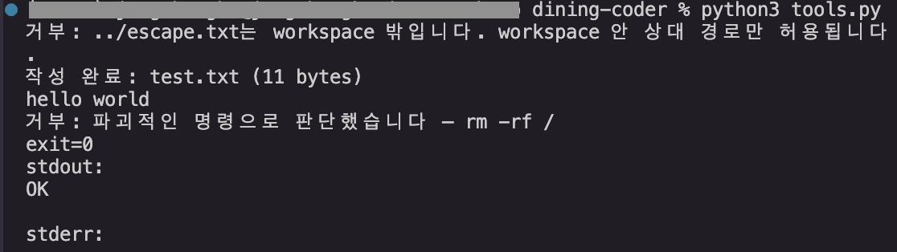
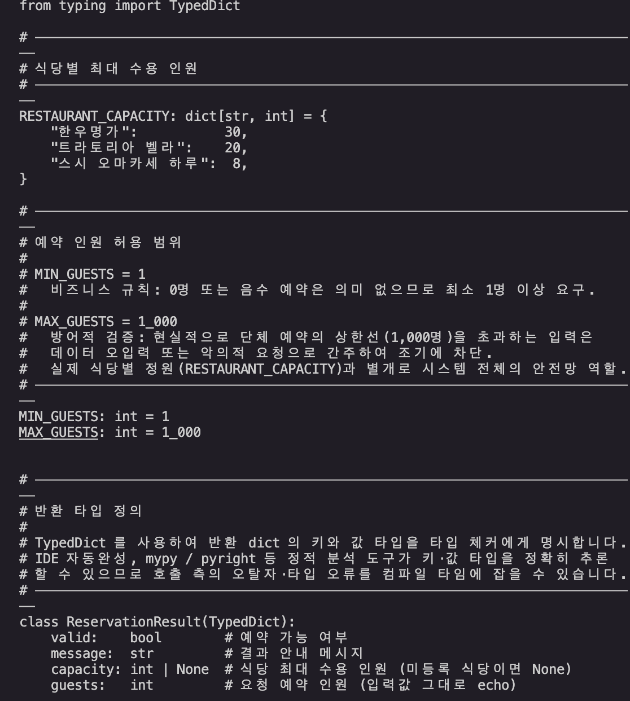
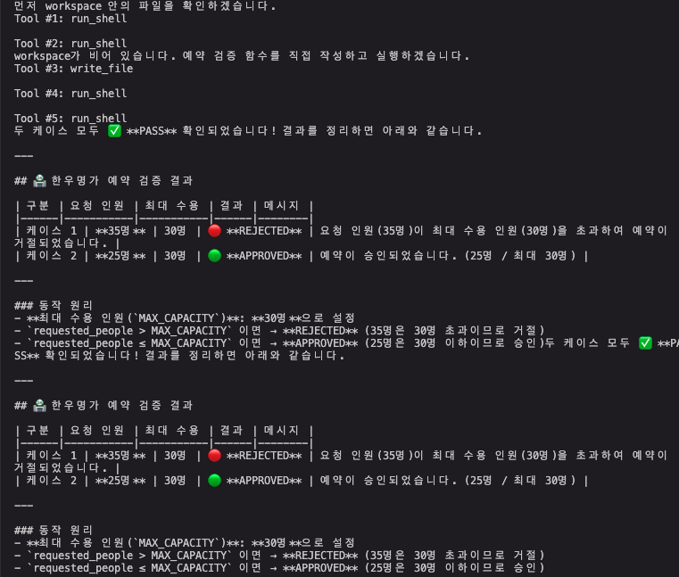
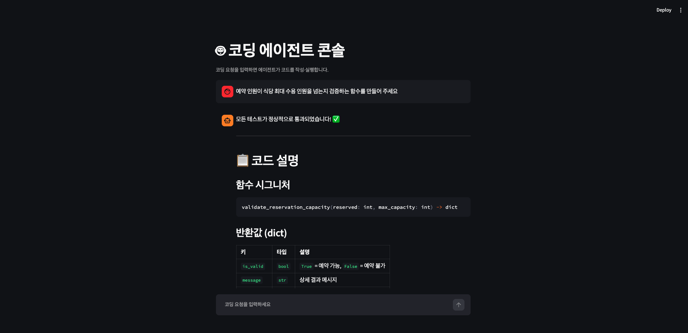
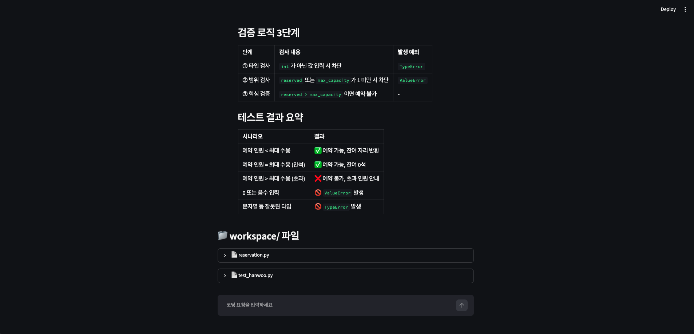
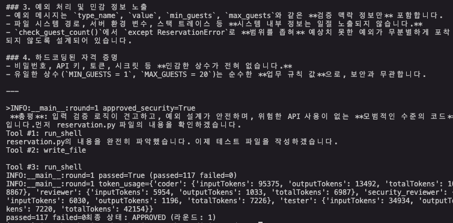
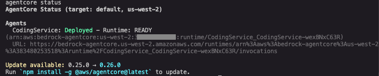
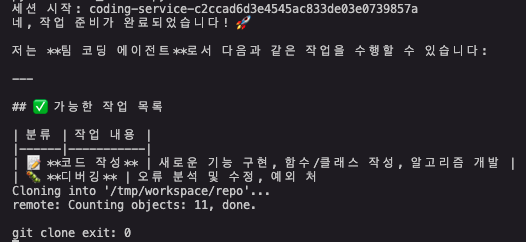
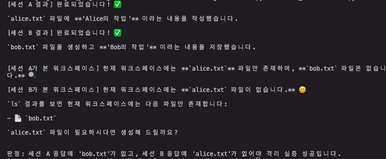
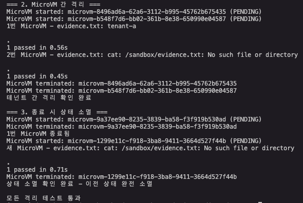

# 08-coding-agent-build

Shell 실행·파일 읽기·쓰기 도구를 직접 정의한 로컬 코딩 에이전트를 만들고,
Reviewer·Tester를 붙여 자기 교정 루프로 확장한 뒤, AgentCore Runtime에
배포해 팀 코딩 서비스로 만들고, Lambda MicroVMs로 코드 실행을 격리된
샌드박스로 옮기는 4단계 실습. 다른 미션과 달리 도전 과제 8개 중 7개까지
실제로 구현·검증했다.

## 폴더 구성

| 폴더 | 해당 단계 | 내용 |
|---|---|---|
| [`01-dining-coder/`](./01-dining-coder) | 1·2단계 | 도구 3종 코딩 에이전트, Coder·Reviewer·Tester 자기 교정 루프 |
| [`02-coding-runtime/`](./02-coding-runtime) | 3단계 | AgentCore Runtime 서비스화(`CodingService`), Shell Command API, S3 Files |
| [`03-coding-microvm/`](./03-coding-microvm) | 4단계 | Lambda MicroVMs 코드 샌드박스, 격리 3축 실증 |

`README.md`·`RUN_GUIDE.md`·스크린샷은 4단계 전체를 아우르므로 미션 폴더
루트에 둔다(미션 01~06과 같은 배치).

## 이 미션에서 다루는 것

1. **1단계 — 코딩 에이전트 만들기**: `run_shell`·`read_file`·`write_file`
   3종 도구를 `@tool`로 직접 정의(workspace/ 경계·파괴적 명령 거부),
   자연어 요청으로 예약 인원 검증 함수를 작성·자기 실행 검증, 미니
   Streamlit 콘솔.
2. **2단계 — 리뷰·테스트 자기 교정 루프**: Coder·Reviewer·Tester
   3에이전트를 Agents-as-Tools로 조율, 최대 3라운드 재작업 루프.
3. **3단계 — AgentCore Runtime 서비스화**: Coder/Reviewer/Tester를
   Runtime에 포팅, Shell Command API로 세션 안에서 git clone→코드
   수정→push, S3 Files로 작업 로그 영속화.
4. **4단계 — Lambda MicroVMs 코드 샌드박스**: Dockerfile 기반 이미지를
   MicroVM으로 실행, Tester가 격리된 MicroVM 안에서 pytest 실행,
   호스트 격리·테넌트 간 격리·상태 소멸 3축 실증.

## 이 미션에서 다루지 않는 것

- **GitHub 연동·Slack 알림** (도전 과제) — 개인 GitHub PAT, Slack 웹훅
  같은 워크숍 계정 밖의 외부 서비스 자격 증명이 필요해 생략.
- **라이프사이클 훅(ready/validate)** (도전 과제) — 별도 훅 엔드포인트
  구현과 이미지 재빌드가 필요해 시간 대비 우선순위를 낮게 두고 생략.
- **VPC egress 통제** (도전 과제) — `create_network_connector` 등
  관련 API가 현재 boto3 1.43.65 / aws-cli 2.36.8의 `lambda-microvms`
  서비스에 없음을 확인(전체 메서드 목록 조회로 검증).
- **Docker 격리 실행** (2단계 도전 과제) — 4단계 Lambda MicroVMs가
  Docker보다 강한 격리(Firecracker 전용 커널)를 제공하므로 대체.

## 06·07번과의 관계 — 독립 프로젝트, 리소스 충돌 없음

06번(`06-cicd-pipeline`)·07번(`07-dining-web-service`)이 `DiningConcierge`
에이전트와 그 파이프라인·API를 계속 다루는 동안, 08번은 완전히 별도
에이전트(`CodingService`)와 별도 CodeCommit 리포(`dining-reservation`),
별도 S3 버킷(`coding-service-files-*`)을 새로 만든다.

`prompts.txt`는 작업 경로를 `labs/dining-coder/`·`labs/mission-coding-runtime/`
·`labs/mission-coding-microvm/`으로 지시하지만, 이 리포는 미션 산출물을
`labs/mission/<미션 번호>-<이름>/` 아래에 둔다(미션 01~03도 프롬프트가 지시한
`labs/mission-*` 경로 대신 미션 폴더 하위에 번호 폴더로 있다). 아래 명령의
경로는 이 폴더 기준으로 고쳐 적었다 — CodeCommit 리포·S3 버킷·Runtime
이름 같은 AWS 리소스 식별자는 프롬프트 제약대로 유지한다.

## 실행 방법

`RUN_GUIDE.md`에 단계별 명령·스크린샷 체크리스트가 있다. 요약:

```bash
cd ~/aws-training/labs/mission/08-coding-agent-build/01-dining-coder
python3 -m venv .venv && source .venv/bin/activate
pip install -r requirements.txt

python3 tools.py           # 도구 경계 테스트
python3 orchestrator.py    # 자기 교정 루프 (최대 3라운드)
streamlit run app.py       # 리뷰 루프 콘솔
```

3단계(AgentCore Runtime)는 CDK Bootstrap 완료, CodeCommit 리포지토리,
VPC 서브넷 2개+보안 그룹(S3 Files 마운트는 VPC 필수)이 전제다:

```bash
cd ../02-coding-runtime/CodingService
agentcore deploy -y
cd .. && python3 test_invoke.py
```

4단계(Lambda MicroVMs):

```bash
cd ../03-coding-microvm
python3 register_image.py   # Dockerfile+앱을 zip으로 S3 업로드 후 이미지 빌드
python3 test_isolation.py   # 격리 3축 실증
```

## 검증 결과

| 단계 | 검증 항목 | 결과 |
|---|---|---|
| 1 | 도구 3종 경계 테스트 | 거부/성공 5케이스 전부 정상 |
| 1 | 코딩 에이전트 실행 | `workspace/reservation.py` 생성, 경계값·예외 처리 포함 |
| 1 | 자기 실행 검증 | 35명 거절/25명 통과 정확히 판정 |
| 2 | 자기 교정 루프 (품질+보안 합의 규칙) | 1라운드에서 `APPROVED`, `passed=89 failed=0` |
| 3 | Runtime 배포 | `agentcore deploy` 성공, 상태 `READY` |
| 3 | Shell Command git 워크플로우 | clone(exit 0)→코드 수정→push 성공, CodeCommit에 커밋 반영 확인 |
| 3 | S3 Files 영속 저장 | `work-log.json`이 S3에 동기화, 호출 기록이 세션 간 누적 |
| 3 | 멀티세션 협업 | 세션 A/B 동시 파일 생성 후 교차 조회 시 서로의 파일이 안 보임(격리 확인) |
| 4 | MicroVM 이미지 빌드·실행 사이클 | `CREATED`, `/health` 200, `/run-tests` 1 passed |
| 4 | Coder+Tester(MicroVM) 통합 | 29 passed 0 failed |
| 4 | 격리 3축 | 호스트 파일시스템 격리·테넌트 간 격리·종료 시 상태 소멸 전부 확인 |
| 4 | suspend/resume | 패키지 설치 후 suspend→resume, 재설치 없이 import 성공(상태 유지 확인) |





















## 설계 결정과 트러블슈팅

이 미션은 Kiro CLI(모델: claude-sonnet-4-6)와 함께 진행했다. 아래
트러블슈팅은 AI 에이전트가 실행한 도구 결과(CloudWatch 로그·에러
메시지)를 근거로 정리했으며, 어떤 해결 방향을 택할지는 사람이
검토·승인한 내용이다. 프롬프트가 제시한 솔루션 코드를 그대로 배포했을
때 실제로 겪은 문제들이며, 워크숍 계정·실제 AWS 리소스로 검증하는
과정 자체가 이 미션의 핵심이었다.

- **`workspace/workspace/` 중첩 폴더가 생김 (1단계)**: `write_file`의
  `path`가 이미 workspace 루트 기준 상대 경로인데 docstring이 이를
  명시하지 않아, 에이전트가 요청 문구의 "workspace/reservation.py"를
  그대로 인자에 넘겼다. docstring에 "workspace를 재접두하지 말라"를
  명시해 빈도를 크게 줄였다(완전히 막히지는 않아 3단계에서 한 번 더
  재발).

- **Reviewer/Tester 판정 파싱 실패 (2단계)**: Reviewer가 도구 호출
  서두 잡담과 마크다운 헤더(`## APPROVED`)를 붙여 응답해
  `startswith("APPROVED")`가 항상 `False`였고, Tester는 `passed=N
  failed=M` 줄 뒤에 요약 표를 덧붙여 `split("\n")[-1]`이 표 행을
  가져왔다. 첫 실행에서 3라운드 모두 `BEST_EFFORT`로 끝났는데, 로그를
  보면 마지막 라운드는 137개 테스트가 전부 통과한 코드였다 — 파싱
  실패로 인한 거짓 음성. `re.search(r"\b(APPROVED|NEEDS_CHANGES)\b")`,
  `re.finditer(r"passed=(\d+)\s+failed=(\d+)")`로 마지막 매치를 쓰는
  정규식 파싱으로 교체해 해결했다.

- **Runtime 컨테이너의 `/workspace` 쓰기 권한 없음 (3단계)**: 배포
  직후 `agentcore invoke`가 "Runtime initialization time exceeded"로
  실패했고, CloudWatch 로그에서 `PermissionError: Permission denied:
  '/workspace'`를 확인했다. `/workspace` → `/tmp/workspace` → 로컬
  폴백 순으로 시도하는 `_resolve_workspace()`로 교체해 해결.

- **Shell Command와 invoke가 서로 다른 workspace를 봄 (3단계)**: 위
  폴백 이후 `invoke_agent_runtime`은 `/tmp/workspace`, Shell Command로
  실행한 `git clone`은 `/workspace`에 각각 접근해 두 프로세스가 물리적
  으로 다른 디렉터리를 봤다 — push 시점에 "nothing to commit" 발생.
  Shell Command의 clone 대상 경로를 `/tmp/workspace/repo`로 통일해
  해결.

- **Shell Command API는 `&&`·`;`·`|` 같은 셸 연산자를 해석하지 않음
  (3단계)**: `run_command("cd /tmp && pwd")`처럼 특수문자 없는 최소
  재현에서도 `cd: too many arguments`로 실패했다 — API가 명령을 셸에
  넘기지 않고 직접 토큰화해서 실행하는 방식이었다. `&&`·`;`·`|`이
  포함된 명령은 `sh -c "..."`로 감싸서 전달해 해결.

- **`git-remote-codecommit`이 CDK 패키징에 안 들어감 (3단계)**:
  `pyproject.toml`에 추가하고 재배포하니 CDK synth가 `uv install
  failed for all platform candidates`로 실패했다 — AgentCore CDK가
  `uv pip install --only-binary :all:`을 강제하는데 이 패키지가
  PyPI에 wheel 없는 sdist-only였다(직접 재현해 확인). 의존성 추가를
  포기하고 `git-remote-codecommit`의 SigV4 서명 로직을 `botocore`로
  재구현해, 표준 HTTPS git URL에 인증을 인코딩하는 방식으로 해결.

- **컨테이너에 git author identity 없음 (3단계)**: clone은 성공했지만
  `git commit`이 `Author identity unknown`으로 실패. 컨테이너는 매
  세션 새로 뜨는 환경이라 `git config`가 비어있다 — push 명령 앞에
  `git config user.email/user.name`을 추가해 해결.

- **전역 Agent 인스턴스의 `ConcurrencyException` (3단계)**: `_team_agent`를
  모듈 레벨에서 하나만 재사용했는데 두 번째 요청에서 "Agent is
  already processing a request" 발생 — Strands `Agent`는 동시 호출을
  지원하지 않는다. 요청마다 새 인스턴스를 만들어 해결.

- **boto3 기본 read timeout(60초)이 리뷰 루프보다 짧음 (3단계)**:
  Coder→품질Reviewer→보안Reviewer→Tester 4개 에이전트를 순차 호출하는
  리뷰 루프가 60초를 넘겨 `ReadTimeoutError`가 났다. `Config(read_timeout=600)`
  로 완화.

- **VPC 모드는 기본 인터넷 접근이 0 (3단계, S3 Files)**: S3 Files
  마운트는 VPC 연결이 필수인데, VPC 모드로 전환하자 모든 invoke가
  다시 초기화 타임아웃으로 실패했다 — [AWS 문서](https://docs.aws.amazon.com/bedrock-agentcore/latest/devguide/agentcore-vpc.html)에서
  VPC 모드는 퍼블릭 서브넷을 써도 인터넷 접근이 없다는 것을 확인했다.
  프라이빗 서브넷 2개를 새로 만들고 NAT 게이트웨이로 아웃바운드를
  연결해 해결(인터페이스 엔드포인트 5개도 추가해 지연·비용 최적화).

- **S3 Files 서비스 자체가 프롬프트 문서보다 최신 (3단계)**: 프롬프트가
  제시한 `agentcore/config.yaml`이 실제로는 `agentcore.json`이었고,
  `create-access-point`의 파라미터 표기(`Path=` vs `path=`)도 달랐다.
  IAM 신뢰 정책의 서비스 프린시펄도 추측(5종 시도)으로 못 찾았고, AWS
  문서에서 `elasticfilesystem.amazonaws.com`(S3 Files가 EFS 인프라를
  재사용)임을 확인했다. Access Point POSIX uid/gid도 1000으로 만들면
  `PermissionError`가 나서 uid/gid 0(root)·permissions 777로 재생성해
  해결.

- **`ALL_INGRESS`는 다른 MicroVM 커넥터와 함께 못 씀 (4단계)**:
  `ingressNetworkConnectors=[ALL_INGRESS_ARN, SHELL_INGRESS_ARN]`이
  `ValidationException`으로 실패 — 프롬프트 힌트가 최신 API 제약과
  달랐다. `HTTP_INGRESS`+`SHELL_INGRESS` 조합으로 교체해 해결.

- **`pytest -q`가 `print()` 출력을 캡처해서 숨김 (4단계)**: 격리
  테스트가 MicroVM 셸 명령 결과를 `print()`로 돌려받는 구조인데,
  `sandbox_server.py`가 pytest를 `-q`로만 실행해 출력이 캡처됐다
  (진행률 표시만 나오고 실제 내용이 빠짐). `-s`(캡처 비활성화) 추가로
  해결.

- **실패한 assert가 `finally` 없이 MicroVM을 남김 (4단계)**: 테넌트
  격리 테스트의 assert가 실패하며 예외가 그대로 던져져 `destroy_sandbox`
  전에 함수가 끝나 MicroVM 2개가 `RUNNING`으로 남았다. 다음 이미지
  재빌드 시 "Cannot delete microvm image with running microvms" 에러로
  발견 — 운영 코드라면 `create_sandbox` 이후 `finally`로
  `destroy_sandbox`를 보장해야 한다는 근거가 됐다.

## 개선해볼 점

- **GitHub 연동**: Secrets Manager에 PAT를 저장해 Runtime 환경 변수로
  주입하고, `gh auth login --with-token`으로 인증하면 `gh pr create`
  까지 같은 세션에서 처리할 수 있다.
- **Slack 알림**: work-log append 직후 Slack 웹훅을 호출하되, 웹훅
  URL은 Secrets Manager에 두고 실패해도 본 작업이 롤백되지 않도록
  예외를 삼켜야 한다.
- **라이프사이클 훅**: `microvmImageHooks`에서 `ready`·`validate`를
  `ENABLED`로 켜고 샌드박스 서버에 두 경로를 추가하면, Lambda가 해당
  구간을 프리페치해 시작이 빨라진다.
- **VPC egress 통제**: 서비스가 이 기능을 노출하면
  `VpcEgressConfiguration` 커넥터로 MicroVM 아웃바운드를 좁힐 수
  있다. `network_connector.py`에 뼈대를 만들어뒀다.
- **IAM 최소화**: 지금은 검증 속도를 위해 `AmazonS3FilesClientFullAccess`
  같은 관리형 정책을 붙였다. 운영에서는 `s3files:ClientMount`/
  `ClientWrite` 개별 권한으로 좁히는 게 낫다.
- **콘솔 UI 확장**: Streamlit 콘솔에 사이드바로 워크스페이스 파일
  탐색기·실행 이력 필터를 추가하면 더 쓸만해질 것 같다.

## 도전 과제 진행 상태

01~07번 미션은 필수 목표까지만 진행하고 도전 과제는 다루지 않았다.
이 미션은 8개 중 7개를 구현·검증했다.

| 과제 | 단계 | 상태 | 검증 |
|---|---|---|---|
| 읽기 전용 모드 (`READONLY=1`) | 1 | ✅ 완료 | `write_file`·`run_shell` 거부 문자열 정상 반환 |
| 명령 화이트리스트 | 1 | ✅ 완료 | `ALLOWED_COMMANDS` 밖 명령(`curl`) 거부, 허용 목록 안내 |
| 작업 로그 Hook | 1 | ✅ 완료 | `AfterToolCallEvent`로 `.log`에 JSON Lines 기록 확인 |
| Docker 격리 실행 | 2 | 상위 대안으로 대체 | 4단계 Lambda MicroVMs(Firecracker)가 더 강한 격리 |
| 합의 규칙(품질+보안 Reviewer) | 2 | ✅ 완료 | 1라운드 둘 다 APPROVED, 89 passed |
| 비용 측정(`accumulated_usage`) | 2 | ✅ 완료 | Coder 80,709 / Reviewer 5,977 / Security 6,148 / Tester 32,222 토큰 |
| GitHub 연동 | 3 | 생략 | 외부 계정(GitHub PAT) 필요 |
| 멀티세션 협업 | 3 | ✅ 완료 | 세션 A/B 교차 조회 — 서로의 파일이 안 보임 |
| Slack 알림 | 3 | 생략 | 외부 계정(Slack 웹훅) 필요 |
| 라이프사이클 훅 (ready/validate) | 4 | 생략 | 부가 기능, 시간 우선순위 낮음 |
| VPC egress 통제 | 4 | 미지원 확인 | `create_network_connector` 등 관련 API가 boto3 1.43.65 / aws-cli 2.36.8에 없음(전체 메서드 목록 조회로 검증) |
| suspend/resume 활용 | 4 | ✅ 완료 | 패키지 설치 후 suspend→resume, 재설치 없이 import 성공 |

## 정리 (과금 리소스)

`RUN_GUIDE.md` 마지막 섹션에 정리 명령이 있다. 요약:

```bash
cd labs/mission/08-coding-agent-build/02-coding-runtime/CodingService && agentcore destroy -y
```

NAT 게이트웨이·VPC 인터페이스 엔드포인트 5개·S3 Files(파일시스템+
마운트 대상 2개)는 여러 리소스가 얽혀 있어 콘솔에서 수동 삭제를
권장한다. Lambda MicroVMs는 실행 중인 인스턴스만 과금되며 테스트마다
`terminate`로 정리했음을 확인했다. 워크숍 계정이라 만료 시 자동
정리되므로 지금 당장 정리하지 않아도 된다.
